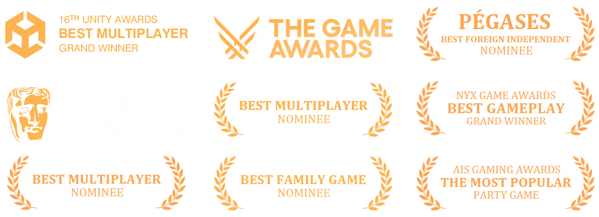
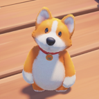

+++
title = "Party Animals"
description = ""
summary = "3D Designer (2021 - 2023)"
featuredImage = "home-top.webp"
tags = ["Arcade"]
categories = ["Game"]
collections = ["Party Animals"]
layout = "halfcard-list"
draft = false
+++


 View on Steam


<iframe src="https://store.steampowered.com/widget/1260320/" frameborder="0" width="646" height="190"></iframe>


 Offical Website


I was one of the two 3D Environment Artists responsible for the level map **Beat-Up Bridge** and **Gator Valley**.

I was also responsible for 3D **UI Assets**.