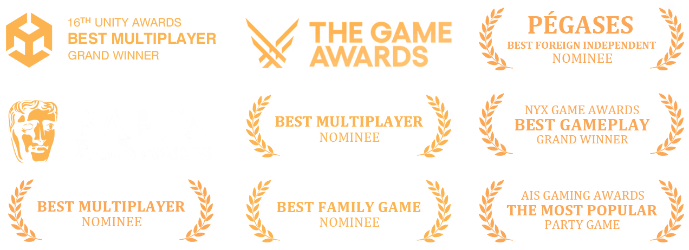
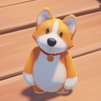

+++
title = "Party Animals"
description = ""
summary = "3D Designer (2021 - 2023)"
featuredImage = "home-top.webp"
categories = ["Game"]
collections = ["Multi-Player PC Game"]
layout = "halfcard-list"
weight = 3
draft = false
+++

<iframe src="https://store.steampowered.com/widget/1260320/" frameborder="0" width="646" height="190"></iframe>


 View on Steam



 Offical Website


Party Animal is a multiplayer physics-based party game that has received widespread international recognition and industry awards.

I had been a fan of the game even before joining the development team. When the early demo was released, it quickly went viral and attracted a large global player base.

During development, I worked primarily as a **3D Environment Artist**, and also supported the UI team by creating several **3D assets used in the game’s interface**.

I was one of two level artists responsible for designing and building the maps **Beat-Up Bridge** and **Gator Valley**. Working on these levels was both an enjoyable and highly valuable learning experience.

You can explore detailed breakdowns of these levels and assets through the links below.

