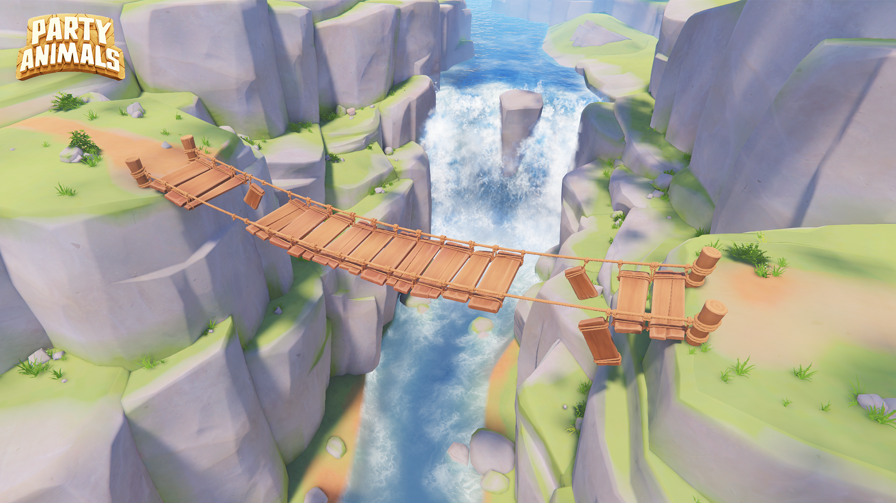
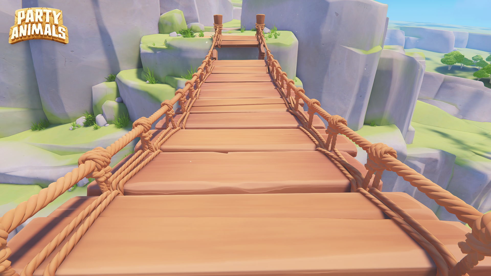

+++
title = "Beat-Up Bridge"
description = "Physics-driven level featuring modular destruction and rope break system."
summary = "Last-stand Map: Stay on the bridge and stay alive"
draft = false
featuredImage = "Beat-Up_Bridge_01.png"
tags = ["Game Level", "Last Stand"]
categories = ["Game Assets"]
collections = ["Party Animals"]
weight = 1
+++

 Level Artist 

## Level Overview

- **Name**: Beat-Up Bridge
- **Role**: Level Artist
- **Tools**: Maya / ZBrush / Substance 3D Painter / Marmoset Toolbag
- **Engine**: Unity
- **Responsibilities**: Build the bridge and set up physics interaction, place foliage, bake scene lighting, optimize real-time rendering performance
- **Key Challenges**: Modular design, real-time physics stability, rope break implementation, multiplayer performance optimization



Beat-Up Bridge is a physics-driven dynamic multiplayer "Last Stand" map in Party Animals. 

The level was designed to create escalating chaos when teams compete on a suspended wooden bridge. As the match progresses, individual planks begin to fall away. Under certain conditions, the whole bridge can collapse. Players must stay on the bridge and stay alive, holding onto a plank for too long will drain stamina and eventually cause them to fall.

## Hero Shots 

## Model Breakdown

### Modular Bridge Segment Design

The bridge was constructed using modular planks and rope segments to support scalable destruction and physics-based interaction.

The initial concept art provided overall mood and layout direction but the exact structural construction did not align with the level design requirement. Therefore, I iterated on multiple explorations to determine the structure while maintain the believability within the stylized world.

After several exploration:

This structure was selected for production and high-poly modeling began from here.

### Highpoly & Lowpoly

Since this bridge is going to be frequently very close to the player's camera during gameplay, bevel details from the high-poly model were preserved in the low-poly model to maintain strong silhouette and highlight definition. 

- **Triangle Count** (Mesh in the above screenshot): 15,380
- **LOD**: No LODs were implemented due to constant close-range visibility

## Material & Texture

Texture Maps: 
- Base Color
- Metallic
- Roughness
- Normal

Technical Specs:
- Map Size: 2048
- Texel Density: 1.07
- Spacing: 16
- Margin: 8


<figure class="grid-w33">
  
  <figcaption>Plank Set 01 - Base Color Map</figcaption>
</figure>

<figure class="grid-w33">
  
  <figcaption>Plank Set 01 - Roughness Map</figcaption>
</figure>

<figure class="grid-w33">
  
  <figcaption>Plank Set 01 - Normal Map</figcaption>
</figure>



<figure class="grid-w33">
  
  <figcaption>Plank Set 02 - Base Color Map</figcaption>
</figure>

<figure class="grid-w33">
  
  <figcaption>Plank Set 02 - Roughness Map</figcaption>
</figure>

<figure class="grid-w33">
  
  <figcaption>Plank Set 02 - Normal Map</figcaption>
</figure>


### Texture Development Process
This video demonstrates the layered construction of the Base Color map for Plank Set 02:


The material was built using a structured PBR workflow, including:
- Base tonal foundation
- Large-scale color variation pass
- Edge wear and curvature masking
- Hand-painted damage accents
- Subtle saturation shifts to prevent tiling repetition

The goal was to maintain a stylized aesthetic while ensuring strong readability and surface breakup during fast-paced multiplayer gameplay.

## Breaking Bridge Technical Implementation

The bridge ropes were rigged in Maya and connected using Unity's **Configuration Joints** and **Dynamic Bone** script, allowing physically reactive movement when players run, jump, or collide with the structure.

Dynamic Bone interaction test:


### Rope Breaking System

In the level design, each rope segment can break independently. My first attempt was still using the Configuration Joints to simulate the rope breaking. However, this required a large number of joints in the scene, which negatively impacted the performance.

#### Blendshape Implementation

To optimize performance, I implemented a **Blendshape-based rope break system**. Instead of physically detaching mesh pieces, the deformation of the rope cross-section was driven through blendshapes, which also created a stylized snapping effect.

Important technical tricks included:
- Rope tips need to be fully hidden beneath the surface geometry
- Avoiding visible seams during deformation
- Modified vertex normals at connection seams to ensure smooth shading transition between rope segments

Here's what the rope breaking looks like in action:




Several stylization tests were conducted to refine the cross-section shape. This was one of the funny look:

### Rope Breaking VFX

The rope break VFX consists of: 
- Stylized rope chip debris
- Dust burst for impact feedback

The goal was to improve the readability without overwhelming screen clarity during multiplayer chaos.


### Full Bridge Collapse

Finally, the full bridge structural failure. However, this was not used in the final gameplay. Instead, only one side of the bridge breaks, making it even harder for players to stay on the bridge successfully.



## Performance Optimization

<!-- 
  
  
 -->

Optimization strategies included:
- Draw call reduction
- Static batching
- Optimized shadow casters
- Simplified collision meshes for physics cost reduction
- Baking blendshape deformation for the skinned ropes
- Joint count minimization

## Gameplay Screenshots


  
  
  
  
  
  


