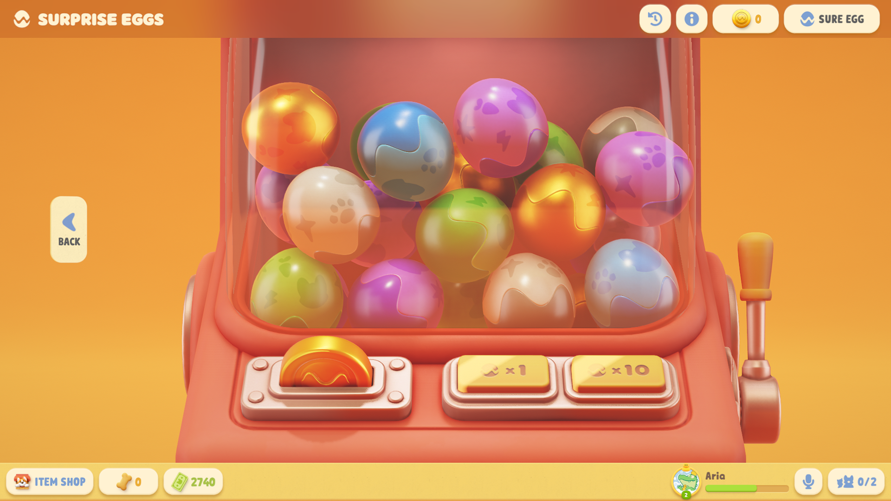
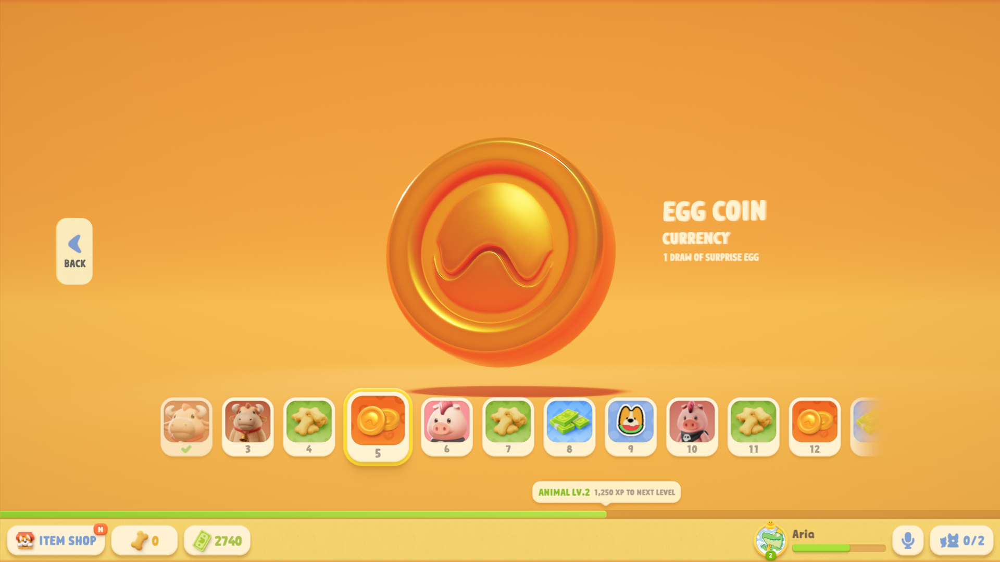
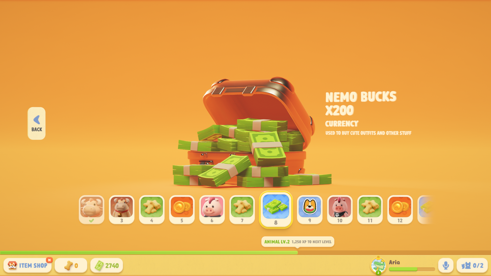
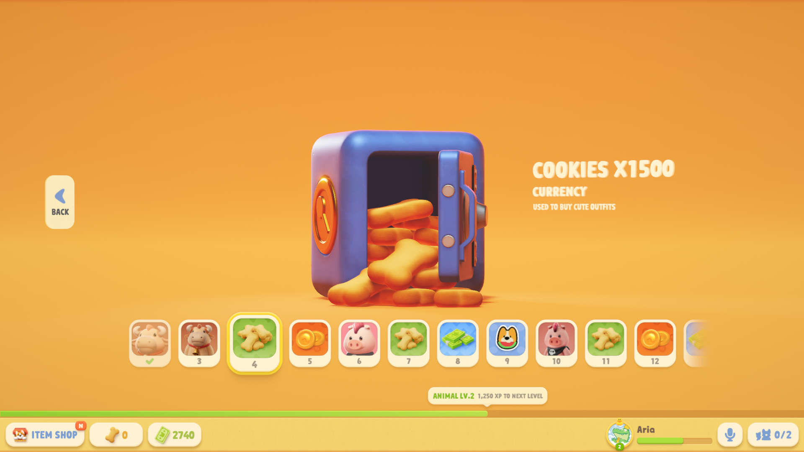
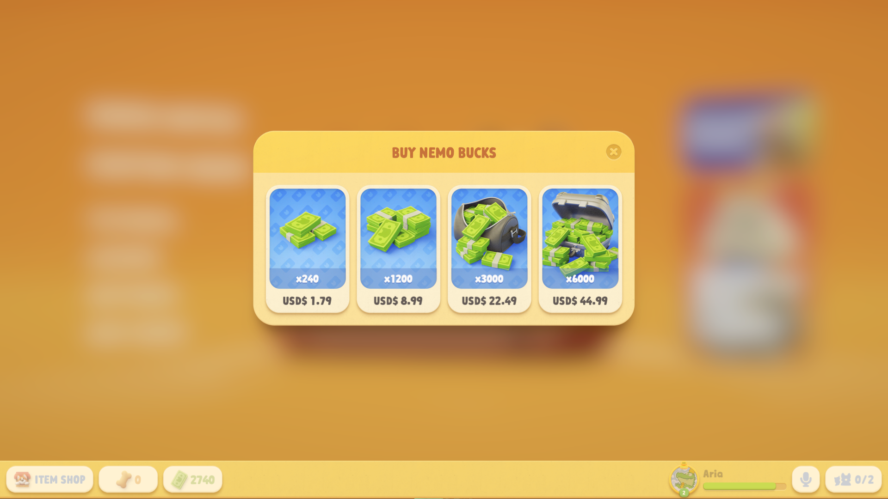
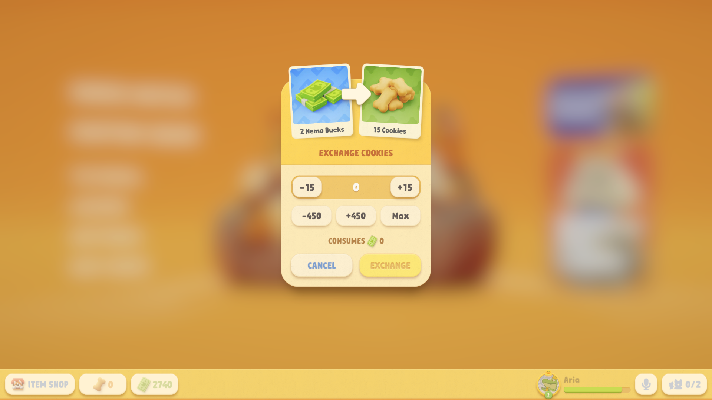
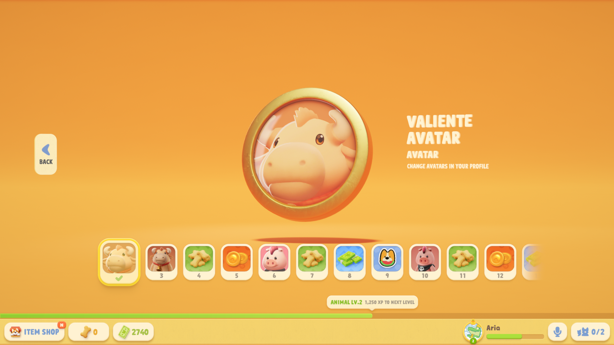
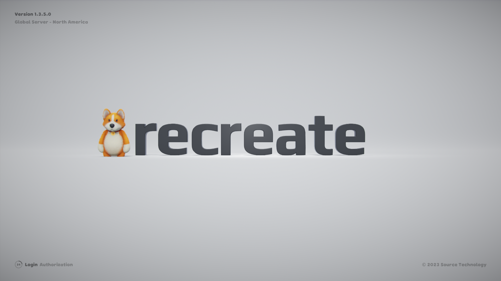

+++
title = "3D UI Assets"
description = ""
summary = ""
draft = false
featuredImage = "images/UI_Surprise_Eggs.png"
tags = ["UI"]
categories = ["Game Assets"]
collections = ["Party Animals"]
weight = 4
+++

## Surprise Eggs Machine
### Surprise Eggs & Machine

### Egg Coin

<!-- Add Video -->

## Currency
### Nemo Bucks

### Cookies

### Rendered UI

## Avatar Frame

")

## Company Logo

## Other


<figure class="grid-w45">
  
  <figcaption>Giftbox</figcaption>
</figure>

<figure class="grid-w55">
  
  <figcaption>Giftbox Opening</figcaption>
</figure>


