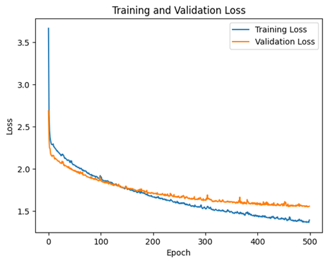
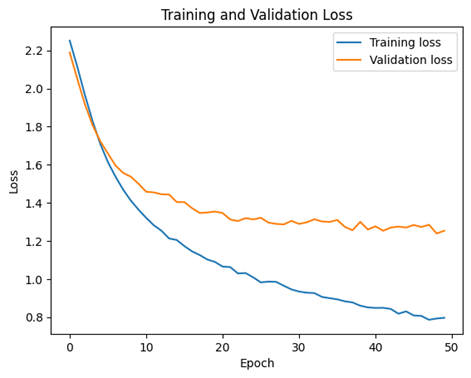
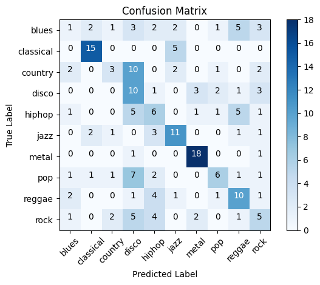
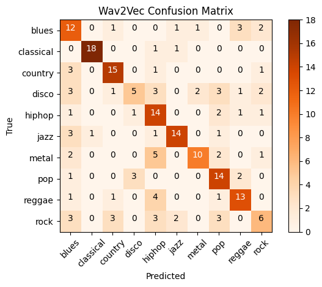
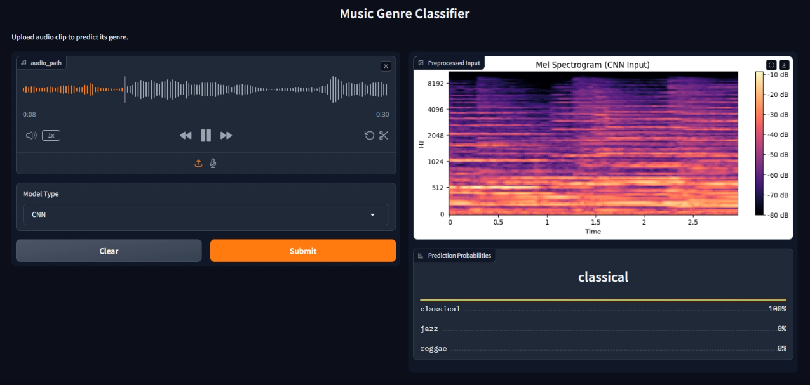
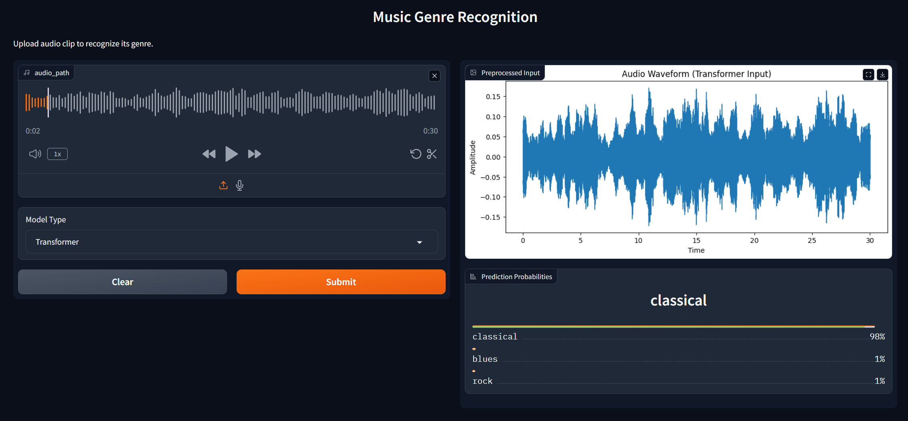

+++
title = "Audio Recognition Comparison Study"
summary = "Comparing CNN-based spatial feature extraction model (ResNet50) and transformer-based temporal model (Wav2Vec 2.0) for audio recognition tasks."
description = ""
featuredImage = "app.png"
tags = ["CNN", "ResNet50", "Transformer", "Wav2Vec 2.0", "Gradio"]
categories = ["AI"]
collections = [""]
weight = 1
draft = false
+++


 View on Google Colab

## Introduction

### Audio Recognition
Process of identifying, classifying, and analyzing audio signals to extract meaningful information.

Common applications: 
Speech recognition, environmental sound classification, music genre classification, etc.

### Objective
To evaluate and compare the performance of CNN-based spatial feature extraction model (ResNet50) and transformer-based temporal model (Wav2Vec 2.0) for audio recognition tasks.

### Research Questions
- Which approach provides better accuracy for audio classification?
- How do different approaches handle various types of audio data?
- What are the computational trade-offs between these methods?

### Previous Work in Audio Recognition

#### Existing Methods
  - Spectrograms processed with CNNs, RNNs, or hybrid architectures 
  - Emerging techniques: Attention mechanisms, transformers

#### Research Gaps
  - Limited comparative analyses of spatial vs. temporal feature extraction
  - Need for evaluations across diverse datasets with varying noise levels and durations


## GTZAN Dataset 
The most widely cited benchmark for music genre classification.
- Contains 1,000 audio tracks, each lasting 30 seconds
- Categorized into 10 musical genres
- Collected between 2000-2001

[GTZAN Dataset - Music Genre Classification](https://www.kaggle.com/datasets/andradaolteanu/gtzan-dataset-music-genre-classification)


## Data Preprocessing
<!-- - Audio data from GTZAN dataset is processed into spectrograms (128×128 pixels).
- Data normalization applied, scaling features to [0,1]. -->
1. Spectrogram images resized to 128×128 pixels and normalized to [0,1] range using `ImageDataGenerator`.
2. Dataset split into training (80%) and validation (20%) sets.
3. Labels encoded with one-hot encoding.

```python
# Normalize pixel values and split into train/validation sets
train_datagen = ImageDataGenerator(
    rescale=1.0/255.0,  # Normalize to [0, 1] 
    validation_split=0.2    # 80% training, 20% validation
)

# Training data generator
train_generator = train_datagen.flow_from_directory(
    DATA_DIR,
    target_size=(IMG_HEIGHT, IMG_WIDTH),
    batch_size=BATCH_SIZE,
    class_mode='categorical',   # One-hot encoded labels 
    subset='training',  # Set as training data
    shuffle=True    # Shuffle to avoid order bias
)

# Validation data generator
val_generator = train_datagen.flow_from_directory(
    DATA_DIR,
    target_size=(IMG_HEIGHT, IMG_WIDTH),
    batch_size=BATCH_SIZE,
    class_mode='categorical',
    subset='validation',  # Set as validation data
    shuffle=True
)
```

## CNN Algorithm (ResNet50)
<!-- - Load pre-trained ResNet50, freeze layers to maintain learned spatial features.
- Attach Global Average Pooling and dense classification layers for genre classification.
- Train model with Adam optimizer and categorical cross-entropy loss. -->
1. Load pre-trained ResNet50 (`ImageNet` weights).
2. Freeze pre-trained layers to retain learned spatial features.
3. Append a custom classification head: 

    **Global Average Pooling** layer
    1. Dense layer with 128 neurons (`ReLU` activation)
    2. Output dense layer with 10 neurons (`Softmax` activation).
4. Compile the model using `Adam` optimizer (learning rate=0.001) and categorical cross-entropy loss.

**ResNet50** is a classic convolutional neural network (**CNN**) architecture widely used for image recognition tasks. This study leverages a pre-trained ResNet50 model (trained on the `ImageNet` dataset) for audio genre classification. The process is detailed as follows:

```py
from tensorflow.keras.applications import ResNet50

# Load pre-trained ResNet50 (trained on ImageNet) 
resnet_base = ResNet50(weights='imagenet', 
                       include_top=False,   # Remove the final classification layer 
                       input_shape=(IMG_HEIGHT, IMG_WIDTH, 3))  # Expects 3-channel (RGB) input 

# Freeze ResNet layers to prevent retraining
for layer in resnet_base.layers:
    layer.trainable = False
```

First, the ResNet50 model that has been pre-trained is imported with the `Keras` library in `TensorFlow`, omitting its original classification layers and keeping solely the convolutional base for extracting spatial features. The parameters of these pre-trained layers are kept fixed during training to maintain acquired general image characteristics and avoid overfitting.

```py
# Add custom classification head
model = models.Sequential([
    resnet_base,    # Feature extraction backbone
    layers.GlobalAveragePooling2D(),    # Reduce spatial dimensions to 1D vector
    layers.Dense(128, activation='relu'),   # Fully connected layer
    layers.Dense(len(CLASS_NAMES), activation='softmax')    # Output layer  
])
```

Following that, a tailored classification head is added to the ResNet50 backbone, which contains a **Global Average Pooling** layer to transform the convolutional output's spatial dimensions into a one-dimensional feature vector. Next, there is a dense layer equipped with 128 neurons and a `ReLU` activation function to improve nonlinear feature representation. Lastly, an output layer featuring ten neurons matching the music genre classes is included, utilizing a `Softmax` activation function for classification objectives.

```py
model.compile(
    optimizer=Adam(learning_rate=0.001),    # Standard learning rate
    loss='categorical_crossentropy',    # Multi-class classification loss
    metrics=['accuracy']
)

# Train the model
history = model.fit(
    train_generator,
    epochs=EPOCHS,
    validation_data=val_generator
)
```

During training, the model employs the Adam optimizer with a learning rate of 0.001 and categorical cross-entropy loss.


## Transformer Algorithm (Wav2Vec 2.0)
<!-- - Leverage Wav2Vec 2.0 pre-trained transformer model with frozen parameters.
- Classification layers include dimensionality reduction and output layers.
- Utilize Adam optimizer and cross-entropy loss during training. -->
1. Load pre-trained Wav2Vec 2.0 model with frozen parameters.
2. Implement a custom classification head:
3. Linear layer reducing dimensions from 768 to 256 (`ReLU` activation)
4. Output linear layer mapping to genre classes.
5. Optimize with `Adam` optimizer (learning rate=0.0001) and cross-entropy loss.

**Wav2Vec 2.0** is an innovative self-supervised learning framework developed by Facebook AI for speech recognition. Launched in 2020, it is an improvement over the previous generation of **Wav2Vec**, significantly reducing the need for large-labeled datasets by leveraging a large amount of unlabeled audio data for pre-training. The model converts the raw audio waveform into a series of discrete speech units. It uses a Transformer-based architecture combined with a quantization module to learn powerful speech features directly from raw audio.

### Audio Dataset for Wav2Vec 2.0 Preprocessing

```py
# Custom Audio Dataset Class
class AudioDataset(Dataset):
    def __init__(self, files, labels, processor, max_len=16000 * 5):
        self.files = files
        self.labels = labels
        self.processor = processor
        self.max_len = max_len

    def __len__(self):
        return len(self.files)

    def __getitem__(self, idx):
        # Load and preprocess audio
        audio_path = self.files[idx]
        label = self.labels[idx]
        signal, sr = sf.read(audio_path)    # Read audio file
        
        # Resample to 16kHz (Wav2Vec's expected sample rate)
        if sr != 16000:
            signal = librosa.resample(signal, orig_sr=sr, target_sr=16000)
            
        # Trim or pad audio to fixed length
        if len(signal) > self.max_len:
            signal = signal[:self.max_len]  # Truncate
        else:
            pad_len = self.max_len - len(signal)
            signal = np.pad(signal, (0, pad_len))   # Zero-padding
            
        # Process with Wav2Vec feature extractor
        inputs = self.processor(signal, sampling_rate=16000, return_tensors="pt", padding=True)
        return inputs.input_values.squeeze(0), torch.tensor(label)
```

`AudioDataset` class organizes audio data for Wav2Vec 2.0. It starts with a collection of audio files, their corresponding labels, a processor, and a limit on duration (5 seconds at 16000 Hz). The length function gives the size of the dataset. The `get_item` function loads an audio file based on its index, fetches its label, and reads the signal with `librosa`. If the sample rate isn’t 16000 Hz, it adjusts the signal's sample rate. The signal is cut off if it exceeds the maximum length or filled with zeros if it is shorter. The processor transforms the signal into a **PyTorch** tensor, yielding the processed input values (compressed) and the label as a tensor for training the model.

### Preparing Audio Data for Wav2Vec 2.0 Training
```py
# Data Preparation
data_dir = "Data/genres_original"
genres = sorted(os.listdir(data_dir))
genre_to_idx = {genre: idx for idx, genre in enumerate(genres)}

# Collect all audio files with labels
files = []
labels = []
for genre in genres:
    genre_path = os.path.join(data_dir, genre)
    for file in os.listdir(genre_path):
        if file.endswith(".wav"):
            files.append(os.path.join(genre_path, file))
            labels.append(genre_to_idx[genre])

# Split data with stratified sampling
train_files, val_files, train_labels, val_labels = train_test_split(files, labels, test_size=0.2, stratify=labels)

# Initialize Wav2Vec processor
processor = Wav2Vec2Processor.from_pretrained("facebook/wav2vec2-base")

# Create datasets and dataloaders
train_dataset = AudioDataset(train_files, train_labels, processor)
val_dataset = AudioDataset(val_files, val_labels, processor)

train_loader = DataLoader(train_dataset, batch_size=8, shuffle=True)
val_loader = DataLoader(val_dataset, batch_size=8)
```

This code gets audio data ready for Wav2Vec 2.0 training. It establishes the data directory *(Data/genres_original)* and enumerates genres as subdirectories, associating each with an index. It gathers *.wav* files along with their genre labels into lists, then divides them into training and validation sets (80-20 split) while maintaining stratification. A **Wav2Vec 2.0 processor** is initialized from the pre-trained model *"facebook/wav2vec2-base"*. The `AudioDataset` class is utilized to generate training and validation datasets along with the corresponding files, labels, and processor. In conclusion, data loaders are established with a batch size of 8, facilitating batch processing, and shuffling is used in the training loader to enhance model generalization.

### Wav2Vec 2.0 Classifier for Genre Classification
```py
# Model Architecture
class Wav2VecClassifier(nn.Module):
    def __init__(self, num_classes):
        super(Wav2VecClassifier, self).__init__()
        # Load pre-trained Wav2Vec2 with frozen weights
        self.wav2vec = Wav2Vec2Model.from_pretrained("facebook/wav2vec2-base")
        for param in self.wav2vec.parameters():
            param.requires_grad = False
        # Custom classification head
        self.classifier = nn.Sequential(
            nn.Linear(768, 256),    # Wav2Vec2 base output dimension
            nn.ReLU(),
            nn.Linear(256, num_classes)
        )

    def forward(self, x):
        # Extract features from frozen Wav2Vec2
        with torch.no_grad():
            x = self.wav2vec(x).last_hidden_state
        # Temporal average pooling
        x = x.mean(dim=1)
        # Classification
        x = self.classifier(x)
        return x

# Initialize model, loss, and optimizer
wav2vec_model = Wav2VecClassifier(num_classes=len(genres)).to(device)
criterion = nn.CrossEntropyLoss()
optimizer = optim.Adam(wav2vec_model.parameters(), lr=1e-4)
```

The `Wav2VecClassifier` class creates a model for classifying audio via **Wav2Vec 2.0**. It starts by loading a pre-trained Wav2Vec 2.0 model ("facebook/wav2vec2-base") and locks its parameters to avoid modifications. A classifier is introduced, which comprises two linear layers (from 768 to 256, and then from 256 to the class count) with a `ReLU` activation in the middle. The forward method retrieves features from the input via `Wav2Vec` (without gradients), averages them over time, and sends them through the classifier to generate class scores. The model is created with the quantity of genres, employs cross-entropy loss, and is enhanced using `Adam` (learning rate 1e-4)

### Training and Validation Loop for Wav2Vec2.0 Model
```py
# Track training progress
train_losses = []
val_losses = []

for epoch in range(50):  # Adjust number of epochs
    # Training phase
    wav2vec_model.train()
    running_loss = 0.0
    for inputs, targets in train_loader:
        # Move data to device
        inputs, targets = inputs.to(device), targets.to(device)
        # Forward pass
        outputs = wav2vec_model(inputs)
        loss = criterion(outputs, targets)
        
        # Backpropagation
        optimizer.zero_grad()
        loss.backward()
        optimizer.step()
        running_loss += loss.item()
    # Calculate epoch training loss
    train_losses.append(running_loss / len(train_loader))

    # Validation phase
    wav2vec_model.eval()
    val_loss = 0.0
    with torch.no_grad():
        for inputs, targets in val_loader:
            inputs, targets = inputs.to(device), targets.to(device)
            outputs = wav2vec_model(inputs)
            loss = criterion(outputs, targets)
            val_loss += loss.item()
    # Calculate epoch validation loss
    val_losses.append(val_loss / len(val_loader))
```

This code trains and assesses a Wav2Vec 2.0 model across 30 epochs. It sets up arrays to hold training and validation loss values. During every epoch, the model enters training mode and handles batches from `train_loader`. Inputs and targets are transferred to the device, and the model calculates outputs and loss based on a criterion. 

The optimizer modifies parameters post-backpropagation, and the mean training loss is documented. For validation, the model transitions to evaluation mode, turning off gradients. It handles val_loader batches, calculates the loss without altering parameters, and tracks the average validation loss, facilitating performance evaluation over epochs.


## Model Evaluation
- Performance assessed by accuracy and confusion matrices.
- Training and validation loss curves plotted for both models.

### Plot Training/Validation Loss Curves
```py
plt.figure()
plt.plot(history.history['loss'], label='Training Loss')
plt.plot(history.history['val_loss'], label='Validation Loss')
plt.title('Training and Validation Loss')
plt.xlabel('Epoch')
plt.ylabel('Loss')
plt.legend()
plt.show()
```


- **Overall Trend**: The loss is steadily decreasing over time, indicating that the model is learning effectively.
- **Training vs. Validation Loss**: Both curves closely follow each other, suggesting that there is no significant overfitting.
- **Final Loss Values**: The loss stabilizes around 1.6 by the end of training.



### Generate and Visualize Confusion Matrix
```py
# Recreate validation generator without shuffling for consistent labels
val_generator_cm = train_datagen.flow_from_directory(
    DATA_DIR,
    target_size=(IMG_HEIGHT, IMG_WIDTH),
    batch_size=BATCH_SIZE,
    class_mode='categorical',
    subset='validation',
    shuffle=False   # Critical for aligning predictions with true labels
)

# Predict on validation data
Y_pred = model.predict(val_generator_cm)
y_pred = np.argmax(Y_pred, axis=1)
y_true = val_generator_cm.classes

# Compute confusion matrix
cm = confusion_matrix(y_true, y_pred)

# Plot confusion matrix 
plt.figure()
plt.imshow(cm, interpolation='nearest', cmap=plt.cm.Blues)
plt.title('Confusion Matrix')
plt.colorbar()
tick_marks = np.arange(len(CLASS_NAMES))
plt.xticks(tick_marks, CLASS_NAMES, rotation=45)
plt.yticks(tick_marks, CLASS_NAMES)
plt.xlabel('Predicted Label')
plt.ylabel('True Label')

# Annotate each cell with values  
thresh = cm.max() / 2.
for i in range(cm.shape[0]):
    for j in range(cm.shape[1]):
        plt.text(j, i, format(cm[i, j], 'd'),
                 horizontalalignment="center",
                 color="white" if cm[i, j] > thresh else "black")
plt.tight_layout()
plt.show()
```





## Interactive System




 View on Google Drive


The interactive system implements a dual-model architecture through an interactive `Gradio` interface, enabling real-time comparison between the two models. The **TensorFlow-based ResNet50** model is loaded from a `SavedModel` format, while the **Wav2Vec2 Transformer** is initialized using `PyTorch` checkpoint parameters including its pretrained processor and genre labels. The interface accepts user-uploaded audio files and a model selection parameter, routing inputs through model-specific preprocessing pipelines.

```py
# Create Gradio interface
interface = gr.Interface(
    fn=predict,
    inputs=[
        gr.Audio(type="filepath"),
        gr.Dropdown(["CNN", "Transformer"], label="Model Type", value="CNN")
    ],
    outputs=[
        gr.Image(label="Preprocessed Input"),  # Visualization
        gr.Label(label="Prediction Probabilities", num_top_classes=3)  # Results
    ],
    title="Music Genre Recognition",
    description="Upload audio clip to recognize its genre.",
    allow_flagging="never"
)

# Run the app
if __name__ == "__main__":
    interface.launch()
```


```py
def preprocess_and_visualize(audio_path, model_type):
    # Create figure for visualization
    fig = plt.figure(figsize=(10, 4))
    # Load audio
    y, sr = librosa.load(audio_path, duration=30)   # Trim to 30 seconds

    if model_type == "CNN":
        # Process and plot spectrogram
        spec = librosa.feature.melspectrogram(y=y, sr=sr, n_mels=128)
        spec_db = librosa.power_to_db(spec, ref=np.max)
        spec_db = librosa.util.fix_length(spec_db, size=128, axis=1)

        plt.title('Mel Spectrogram (CNN Input)')
        librosa.display.specshow(spec_db, x_axis='time', y_axis='mel', sr=sr)
        plt.colorbar(format='%+2.0f dB')
        processed_data = np.stack([spec_db] * 3, axis=-1)

    elif model_type == "Transformer":
        # Transformer processing
        plt.title('Audio Waveform (Transformer Input)')
        librosa.display.waveshow(y, sr=sr)
        plt.xlabel('Time')
        plt.ylabel('Amplitude')

        # Process for Wav2Vec2
        if sr != 16000:
            y = librosa.resample(y, orig_sr=sr, target_sr=16000)
        if len(y) > 16000 * 5:
            y = y[:16000 * 5]
        else:
            y = np.pad(y, (0, max(0, 16000 * 5 - len(y))))
        processed_data = processor(y, sampling_rate=16000, return_tensors="pt").input_values

    # Save visualization to temporary file
    temp_file = tempfile.NamedTemporaryFile(suffix=".png", delete=False)
    plt.savefig(temp_file.name, bbox_inches='tight')
    plt.close(fig)

    return processed_data, temp_file.name
```

The `preprocess_and_visualize` function bifurcates processing based on the selected model type. For CNN inference, audio is converted to mel-spectrograms through **Short-Time Fourier Transform (STFT)** analysis, generating 128×128 RGB images through min-max normalization and channel duplication. Transformer processing utilizes Wav2Vec2's native tokenizer to resample inputs to 16kHz, pad/truncate to 5-second clips, and produce 768-dimensional latent representations. Both paths generate explanatory visualizations - spectrograms for CNN and waveform plots for Transformer - using `Matplotlib`, stored temporarily for UI rendering.





```py
def predict(audio_path, model_type):
    # Get processed data and visualization
    processed_data, vis_path = preprocess_and_visualize(audio_path, model_type)

    # Make prediction
    if model_type == "CNN":
        pred = cnn_model.predict(processed_data[np.newaxis, ...])[0]
        probs = {CLASS_NAMES[i]: float(pred[i]) for i in range(len(CLASS_NAMES))}
    elif model_type == "Transformer":
        with torch.no_grad():
            outputs = transformer_model(processed_data)
            probabilities = torch.softmax(outputs, dim=1).numpy()[0]
            probs = {genres[i]: float(probabilities[i]) for i in range(len(genres))}

    return vis_path, probs
```
The `predict` method executes model-specific inference routines. The CNN processes spectrograms through ResNet50's convolutional layers (pretrained on `ImageNet`) followed by a custom classification head comprising global average pooling and dense layers. The Transformer leverages Wav2Vec2's self-attention mechanisms to extract temporal features, which are averaged across time steps before final classification. Predictions are formatted as probability distributions across musical genres, with top-3 results highlighted in the interface.


## Results and Findings
### Classification Performance
The ResNet50 CNN’s hierarchical convolution operations proved highly effective for capturing localized spectral patterns.

The transformer’s self-attention mechanism enabled superior modeling of long-range dependencies, particularly beneficial for vocal-centric genres. This result expands upon earlier efforts with RNNs in audio classification, which also captured temporal dependencies but lacked the scalability of attention-based models.


Training and validation losses of ResNet50 start at 3.6 and 2.6, indicating challenges in early spectral feature learning. Losses decline steadily but remain separated, with training loss reaching 1.5 and validation loss plateauing at ~2.0 after 500 epochs. The persistent gap suggests overfitting, likely due to limited spectrogram diversity or insufficient regularization. The extended training (500 epochs) without validation loss stabilization implies suboptimal learning rate scheduling or architectural constraints in modeling temporal variations.


The initial loss of Wav2Vec2 starts at 2.2 for both training and validation, reflecting effective pretrained feature initialization. Losses decrease smoothly and nearly synchronously, reaching 0.8 (training) and 0.85 (validation), demonstrating robust generalization. The 0.05 final gap indicates minimal overfitting. Achieves stable convergence in fewer epochs (estimated 100–150 based on curve slope), leveraging self-attention for faster temporal pattern acquisition.

## Limitations and Future Work
While the transformer achieved higher accuracy, its computational demands limit in resource-constrained scenarios. Hybrid architectures combining CNN front-ends for feature extraction with transformer temporal modeling could balance efficiency and accuracy.

Future work should explore: 
1. Testing pretrained models on environmental sound datasets. 
2. Leveraging transformer pretraining for low-data regimes.
3. Measuring power consumption across different platforms.

## Conclusion
This study demonstrates that both CNN and Transformer architectures can achieve state-of-the-art performance in audio recognition through different feature learning techniques. While the Wav2Vec2-based Transformer shows superior accuracy, the ResNet50 CNN offers better computational efficiency. The developed interactive system can directly compare model behaviors, facilitating informed architecture selection based on application requirements.
