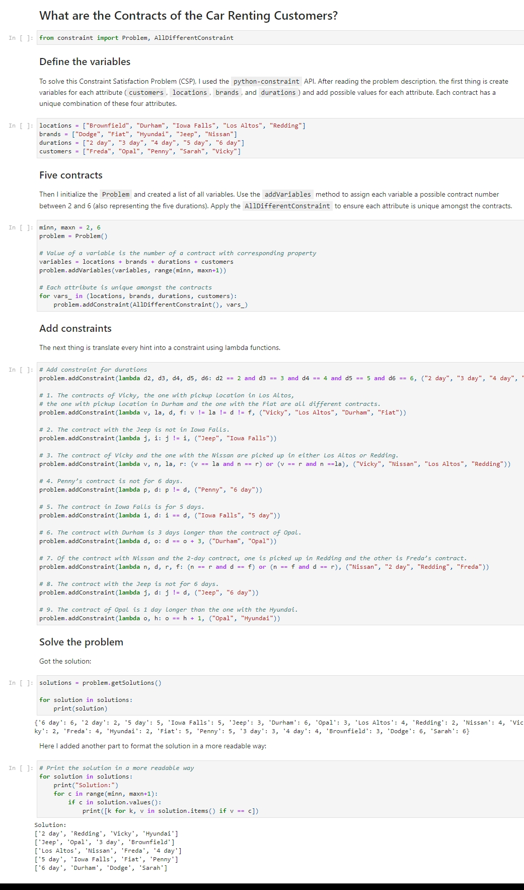

+++
title = "Constraint Satisfaction Problem"
summary = "Solving logic puzzle in Symbolic AI using the python-constraint API."
description = ""
featuredImage = "00.jpeg"
tags = ["Logic Puzzle"]
categories = ["AI"]
collections = [""]
draft = false
+++

## Logic Puzzle “What are the Contracts of the Car Renting Customers?”

There are 5 car renting contracts. Each has duration, a pickup location, a car brand and a customer associated to it. The goal is to find out for all contracts, what the customer, duration, car brand and pickup location is (again given the fact that each attribute is unique amongst the contracts).

### Attributes

- The pickup locations are: Brownfield, Durham, Iowa Falls, Los Altos and Redding.

- The car brands are: Dodge, Fiat, Hyundai, Jeep and Nissan.

- The contract duration are 2, 3, 4, 5 and 6 days.

- The customer names are Freda, Opal, Penny, Sarah and Vicky.

### Hints

1. The contracts of Vicky, the one with pickup location in Los Altos, the one with pickup location in Durham and the one with the Fiat are all different contracts.

2. The contract with the Jeep is not in Iowa Falls.

3. The contract of Vicky and the one with the Nissan are picked up in either Los Altos or Redding.

4. Penny’s contract is not for 6 days.

5. The contract in Iowa Falls is for 5 days.

6. The contract with the Durham is 3 days longer than the contract of Opal.

7. Of the contract with Nissan and the 2 day contract, one is picked up in Redding and the other is Freda’s contract.

8. The contract with the Jeep is not for 6 days.

9. The contract of Opal is 1 day longer than the one with the Hyundai.


 View on Google Colab


