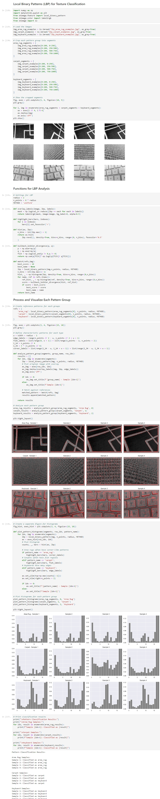

+++
title = "Local Binary Patterns (LBP) for Texture Classification"
summary = "Using the LBP heuristics to distinguish some pattern groups."
description = ""
featuredImage = ""
tags = ["LBP"]
categories = ["AI"]
collections = [""]
weight = 5
draft = false
+++

There are lots of different types of texture descriptors that are used to extract features of an image. Local Binary Pattern, also known as LBP, is a simple and grayscale invariant texture descriptor measure for classification. 

In LBP, a binary code is generated at each pixel by thresholding it’s neighbourhood pixels to either 0 or 1 based on the value of the centre pixel. In this project, I used the LBP heuristics to distinguish some pattern groups.


 View on Google Colab


