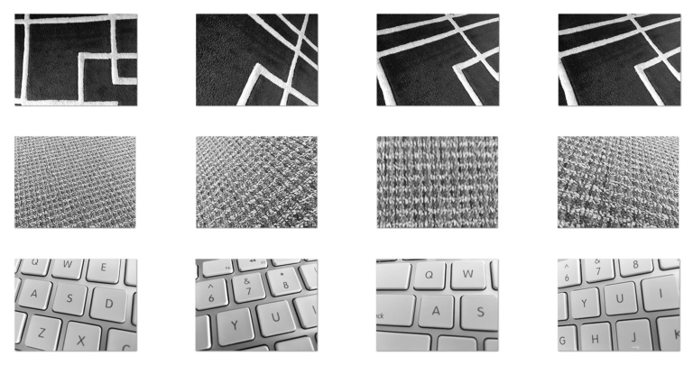
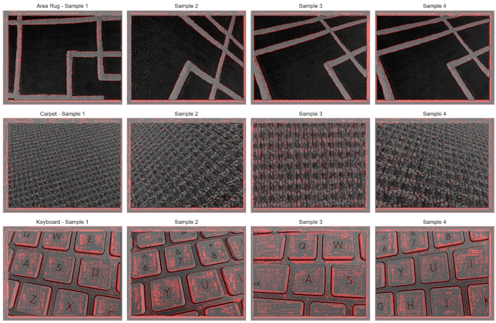
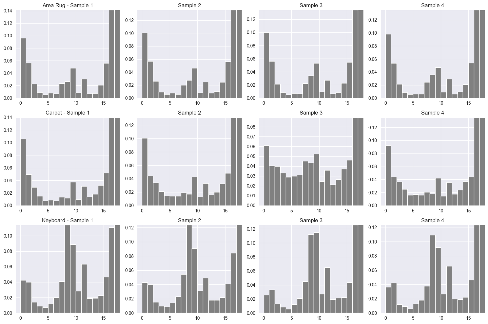

+++
title = "Local Binary Patterns (LBP) for Texture Classification"
summary = "Using the LBP heuristics to distinguish some pattern groups."
description = ""
featuredImage = ""
tags = ["LBP"]
categories = ["AI"]
collections = [""]
weight = 5
draft = false
+++

There are lots of different types of texture descriptors that are used to extract features of an image. Local Binary Pattern, also known as LBP, is a simple and grayscale invariant texture descriptor measure for classification. 

In LBP, a binary code is generated at each pixel by thresholding it’s neighbourhood pixels to either 0 or 1 based on the value of the centre pixel. In this project, I used the LBP heuristics to distinguish some pattern groups.


 View on Google Colab



### Image Loading and Segmentation

1. Load each example image in grayscale for easier texture processing.

    ```py
    # Load the images
    img_area_rug_examples = io.imread("lbp_area_rug_examples.jpg", as_gray=True)
    img_carpet_examples = io.imread("lbp_carpet_examples.jpg", as_gray=True)
    img_keyboard_examples = io.imread("lbp_keyboard_examples.jpg", as_gray=True)
    ```

2. Segment Each Pattern Group: Programmatically segment the images into individual pattern groups.

    ```py
    # Crop each pattern group into segments
    area_rug_segments = [
        img_area_rug_examples[0:200, 0:250],
        img_area_rug_examples[0:200, 250:500],
        img_area_rug_examples[0:200, 500:750],
        img_area_rug_examples[0:200, 750:1000]
    ]
    carpet_segments = [
        img_carpet_examples[0:200, 0:250],
        img_carpet_examples[0:200, 250:500],
        img_carpet_examples[0:200, 500:750],
        img_carpet_examples[0:200, 750:1000]
    ]
    keyboard_segments = [
        img_keyboard_examples[0:200, 0:250],
        img_keyboard_examples[0:200, 250:500],
        img_keyboard_examples[0:200, 500:750],
        img_keyboard_examples[0:200, 750:1000]
    ]
        
    # Show the cropped segments
    fig, axes = plt.subplots(3, 4, figsize=(10, 5))
    plt.gray()
    for i, img in enumerate(area_rug_segments + carpet_segments +keyboard_segments):
        ax = axes[i // 4, i % 4]
        ax.imshow(img)
        ax.axis('off')
    plt.show()
    ```

    

### LBP Calculation and Visualize Each Pattern Group

3. Apply LBP: For each segmented image, apply LBP using `skimage.feature.local_binary_pattern`.

    ```py
    def overlay_labels(image, lbp, labels):
        mask = np.logical_or.reduce([lbp == each for each in labels])
        return label2rgb(mask, image=image, bg_label=0, alpha=0.5)

    def highlight_bars(bars, indexes):
        for i in indexes:
            bars[i].set_facecolor('r')
            
    def hist(ax, lbp):
        n_bins = int(lbp.max() + 1)
        return ax.hist(
            lbp.ravel(), density=True, bins=n_bins, range=(0, n_bins), facecolor='0.5'
        )
    
    def kullback_leibler_divergence(p, q):
        p = np.asarray(p)
        q = np.asarray(q)
        filt = np.logical_and(p != 0,q != 0)
        return np.sum(p[filt]* np.log2(p[filt]/ q[filt]))
    
    def match(refs,img):
        best_score = 10
        best_name = None
        lbp = local_binary_pattern(img,n_points, radius, METHOD)
        n_bins = int(lbp.max()+ 1)
        hist, _ = np.histogram(lbp, density=True, bins=n_bins, range=(0,n_bins))
        for name, ref in refs.items():
            ref_hist, _ = np.histogram(ref, density=True, bins=n_bins, range=(0,n_bins))
            score = kullback_leibler_divergence(hist, ref_hist)
            if score < best_score:
                best_score = score
                best_name = name
        return best_name
    ```


    ```py
    # Create reference patterns for each groups
    refs = {
        'area_rug': local_binary_pattern(area_rug_segments[0], n_points, radius, METHOD),
        'carpet': local_binary_pattern(carpet_segments[0], n_points, radius, METHOD),
        'keyboard': local_binary_pattern(keyboard_segments[0], n_points, radius, METHOD)
    }

    fig, axes = plt.subplots(3, 4, figsize=(15, 10))
    plt.gray()

    # Define characteristic patterns for each type
    w = width = radius - 1
    edge_labels = range(n_points // 2 - w, n_points // 2 + w + 1)
    flat_labels = list(range(0, w + 1)) + list(range(n_points - w, n_points + 2))
    i_14 = n_points // 4
    i_34 = 3 * (n_points // 4)
    corner_labels = list(range(i_14 - w, i_14 + w + 1)) + list(range(i_34 - w, i_34 + w + 1))

    def analyze_pattern_group(segments, group_name, row_idx):
        results = []
        for idx, img in enumerate(segments):
            lbp = local_binary_pattern(img, n_points, radius, METHOD)
            # Plot original image with overlay
            ax_img = axes[row_idx, idx]
            ax_img.imshow(overlay_labels(img, lbp, edge_labels))
            ax_img.axis('off')
            
            if idx == 0:
                ax_img.set_title(f'{group_name} - Sample {idx+1}')
            else:
                ax_img.set_title(f'Sample {idx+1}')
                
            # Match against references
            matched_pattern = match(refs, img)
            results.append(matched_pattern)
            
        return results

    # Analyze each pattern group
    area_rug_results = analyze_pattern_group(area_rug_segments, 'Area Rug', 0)
    carpet_results = analyze_pattern_group(carpet_segments, 'Carpet', 1)
    keyboard_results = analyze_pattern_group(keyboard_segments, 'Keyboard', 2)

    plt.tight_layout()
    ```

    

4. Extract Histograms: For each LBP-transformed segment, calculate the histogram of LBP values. These histograms serve as feature descriptors for each pattern. 

    ```py
    # Create a separate figure for histograms
    fig_hist, axes_hist = plt.subplots(3, 4, figsize=(15, 10))

    def plot_pattern_histograms(segments, row_idx, pattern_name):
        for idx, img in enumerate(segments):
            lbp = local_binary_pattern(img, n_points, radius, METHOD)
            ax = axes_hist[row_idx, idx]
            # Plot histogram
            counts, _, bars = hist(ax, lbp)
            
            # Area rugs often have corner-like patterns
            if pattern_name == 'area_rug':
                highlight_bars(bars, corner_labels)
            # Carpets often have flat regions
            elif pattern_name == 'carpet':
                highlight_bars(bars, flat_labels)
            # Keyboards have many edges
            elif pattern_name == 'keyboard':
                highlight_bars(bars, edge_labels)
                
            ax.set_ylim(top=np.max(counts[:-1]))
            ax.set_xlim(right=n_points + 2)
            
            if idx == 0:
                ax.set_title(f'{pattern_name} - Sample {idx+1}')
            else:
                ax.set_title(f'Sample {idx+1}')

    # Plot histograms for each pattern group
    plot_pattern_histograms(area_rug_segments, 0, 'Area Rug')
    plot_pattern_histograms(carpet_segments, 1, 'Carpet')
    plot_pattern_histograms(keyboard_segments, 2, 'Keyboard')

    plt.tight_layout()
    ```

    

### Classification Results

```py
# Print classification results
print("\nPattern Classification Results:")
print("\nArea Rug Samples:")
for idx, result in enumerate(area_rug_results):
    print(f"Sample {idx+1}: Classified as {result}")

print("\nCarpet Samples:")
for idx, result in enumerate(carpet_results):
    print(f"Sample {idx+1}: Classified as {result}")

print("\nKeyboard Samples:")
for idx, result in enumerate(keyboard_results):
    print(f"Sample {idx+1}: Classified as {result}")
```

```
Pattern Classification Results:

Area Rug Samples:
Sample 1: Classified as area_rug
Sample 2: Classified as area_rug
Sample 3: Classified as area_rug
Sample 4: Classified as area_rug

Carpet Samples:
Sample 1: Classified as carpet
Sample 2: Classified as carpet
Sample 3: Classified as keyboard
Sample 4: Classified as carpet

Keyboard Samples:
Sample 1: Classified as keyboard
Sample 2: Classified as keyboard
Sample 3: Classified as keyboard
Sample 4: Classified as keyboard
```

