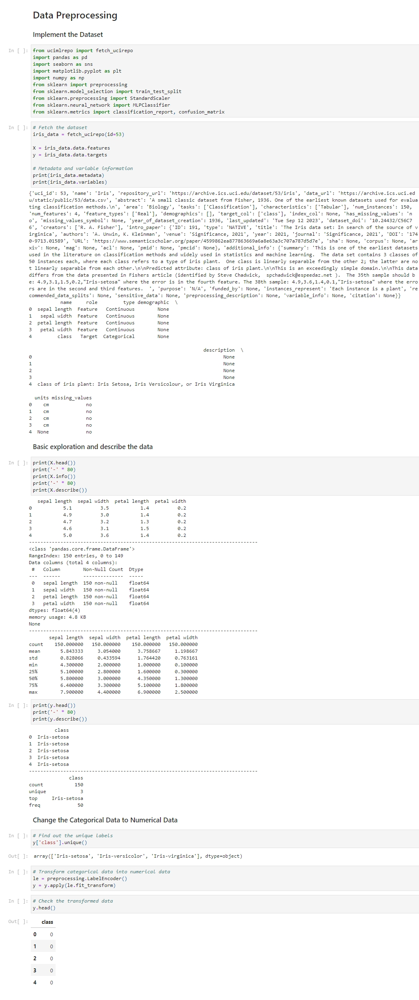
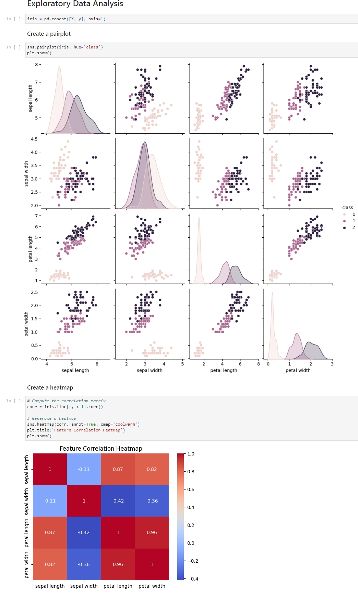
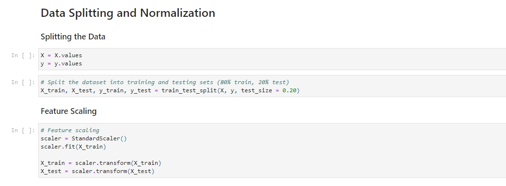
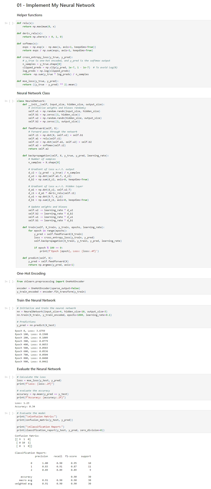
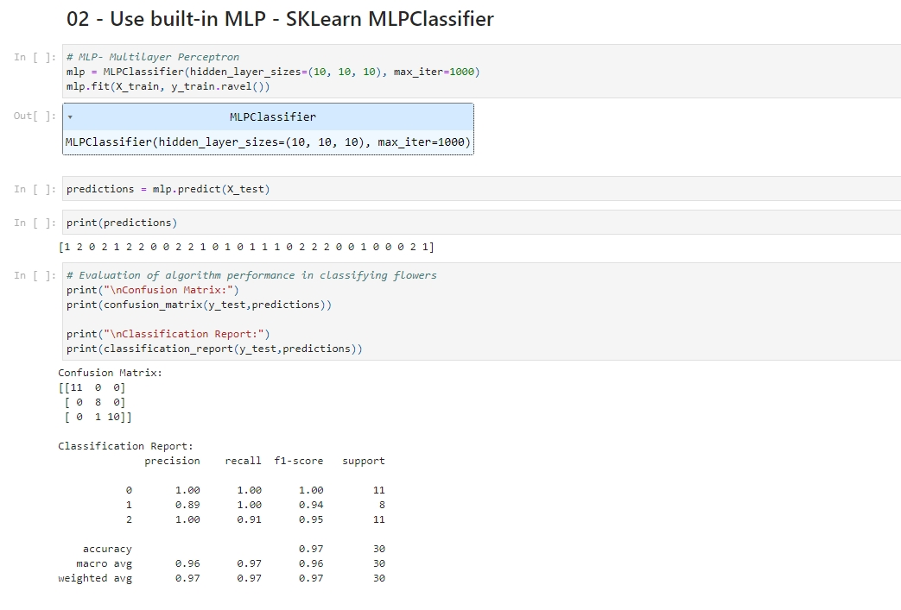
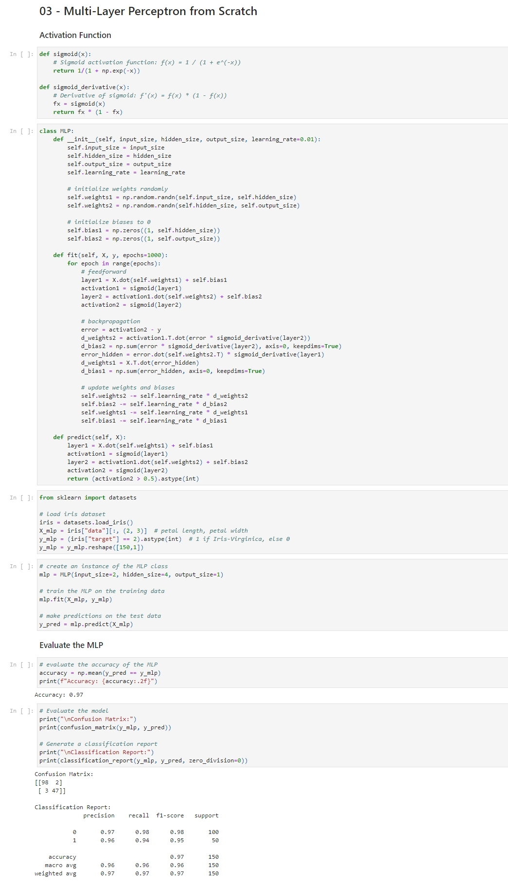
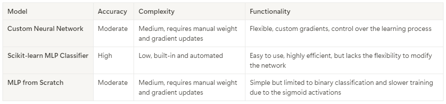

+++
title = "Multi-Layer Perceptrons of Iris Data"
summary = "Comparing a custom Neural Network model with the built-in MLPClassifier from scikit-learn and an MLP built from scratch."
description = ""
featuredImage = ""
tags = ["MLP", "EDA", "scikit-learn"]
categories = ["AI"]
collections = [""]
draft = false
+++


 View on Google Colab


## Data Preprocessing

I fetched the Iris dataset from the UCIML repository. X (features) contains sepal length, sepal width, petal length, and petal width, and y (targets) contains Setosa, Versicolor, and Virginica.

First I did some basic exploration of the data, then I transformed categorical data of the target classes into numerical data (0, 1, 2) using LabelEncoder.

## Exploratory Data Analysis

In this part, I created a pairplot showing the relationships between the features and also colored each class differently. Then I created a heatmap to visualize the correlation between each feature.

### Data Splitting and Normalization

Here, the X (features) and y (targets) are converted to NumPy arrays. Then the dataset is split into training (80%) and test (20%) sets using train_test_split().

I used StandardScaler to normalize the feature values to have a mean of 0 and a standard deviation of 1.

## My Custom Neural Network

In the feedforward propagation steps, the input is processed by the hidden layer using the ReLu activation function, and the output layer applies the softmax function to convert the activations into the probabilities. Then I used cross-entropy as the loss function.

Backward propagation is used to compute the gradients for weights and biases, and they are updated using the gradient descent based on the prediction error.

I used 4 input layers, 1 hidden layer with 10 neurons, and the output layer has 3 neurons. The network is trained for 1000 epochs with a learning rate of 0.1.

## Built-in MLP - scikit-learn's MLPClassifier

In this method, I used the built-in MLPClassifier from the scikit-learn library. It can automate the whole process of building, training, and tuning the model, so I don’t have to do the complex steps.

I used 3 hidden layers, each with 10 neurons, and the output layer has 3 neurons. The model is trained for 1000 iterations

## Multi-Layer Perceptron from Scratch

In this implementation from scratch, the Multi-Layer Perceptron (MLP) model is defined with a single hidden layer and sigmoid activation functions for both the hidden and output layers. The sigmoid activation function maps the input to a value between 0 and 1.

However, since this model has only 1 hidden layer with 4 neurons and a single output layer with 1 neuron, it can only handle binary classification for Iris-Virginica. And the loss of binary classification is calculated using Mean Squared Error (MSE). Gradient descent is used to update the weights based on the error between the predictions and the true labels.

Additionally, this MLP is trained on a simplified Iris dataset, which only has petal length and petal width for the binary classification.

## Summary

My Custom Neural Network gives control over the entire learning process, but is more complex to implement and less accurate.

MLPClassifier from scikit-learn is highly accurate and efficient, but lacks the flexibility.

Basic MLP from Scratch is good for understanding the neural network, but is limited to binary classification and takes longer to train.

