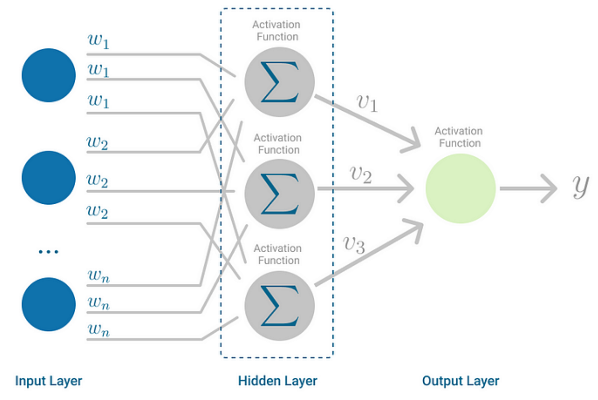
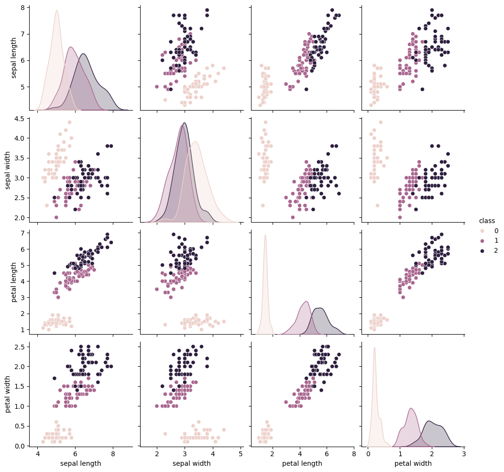
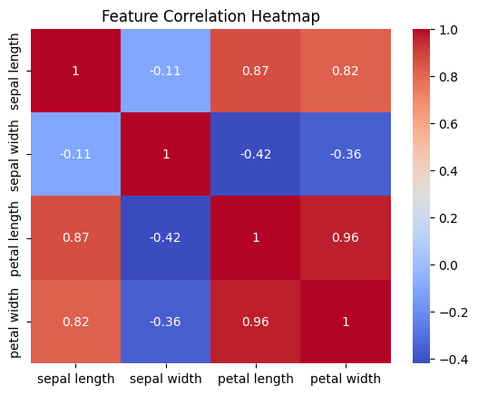

+++
title = "Multi-Layer Perceptrons of Iris Data"
summary = "Comparing a custom Neural Network model with the built-in MLPClassifier from scikit-learn and an MLP built from scratch."
description = ""
featuredImage = ""
tags = ["MLP", "EDA", "scikit-learn"]
categories = ["AI"]
collections = [""]
weight = 7
draft = false
+++

## Multilayer Perceptron

Multilayer Perceptron (MLP) is a name for a modern [feedforward](https://en.wikipedia.org/wiki/Feedforward_neural_network) artificial neural network, consisting of fully connected neurons with a nonlinear kind of activation function, organized in at least three layers, notable for being able to distinguish data that is not linearly separable.

A Multilayer Perceptron has input and output layers, and one or more **hidden layers** with many neurons stacked together. And while in the Perceptron the neuron must have an activation function that imposes a threshold, like ReLU or sigmoid, neurons in a Multilayer Perceptron can use any arbitrary activation function.



Each layer is feeding the next one with the result of their computation, their internal representation of the data. This goes all the way through the hidden layers to the output layer.

**Backpropagation** is the learning mechanism that allows the Multilayer Perceptron to iteratively adjust the weights in the network, with the goal of minimizing the cost function.



 View on Google Colab


## Data Preprocessing

I fetched the Iris dataset from the UCIML repository. `X` (features) contains sepal length, sepal width, petal length, and petal width, and `y` (targets) contains Setosa, Versicolor, and Virginica.

```py
# Fetch the dataset
iris_data = fetch_ucirepo(id=53) 

X = iris_data.data.features
y = iris_data.data.targets

# Metadata and variable information 
print(iris_data.metadata) 
print(iris_data.variables) 
```

First I did some basic exploration of the data, then I transformed categorical data of the target classes into numerical data (0, 1, 2) using `LabelEncoder`.

```py
# Find out the unique labels
y['class'].unique() 

# Transform categorical data into numerical data
le = preprocessing.LabelEncoder()
y = y.apply(le.fit_transform)
```

## Exploratory Data Analysis

In this part, I created a pairplot showing the relationships between the features and also colored each class differently. Then I created a heatmap to visualize the correlation between each feature.

### Create Pairplot

```py
iris = pd.concat([X, y], axis=1)

# Create a pairplot
sns.pairplot(iris, hue='class')
plt.show()
```



### Create Heatmap

```py
# Compute the correlation matrix
corr = iris.iloc[:, :-1].corr()

# Generate a heatmap
sns.heatmap(corr, annot=True, cmap='coolwarm')
plt.title('Feature Correlation Heatmap')
plt.show()
```




## Data Splitting and Normalization

Here, the `X` (features) and `y` (targets) are converted to **NumPy** arrays. Then the dataset is split into training (80%) and test (20%) sets using `train_test_split()`.

```py
X = X.values
y = y.values

# Split the dataset into training and testing sets (80% train, 20% test)
X_train, X_test, y_train, y_test = train_test_split(X, y, test_size = 0.20)  
```

I used `StandardScaler` to normalize the feature values to have a mean of 0 and a standard deviation of 1.

```py
# Feature scaling
scaler = StandardScaler()  
scaler.fit(X_train)

X_train = scaler.transform(X_train)  
X_test = scaler.transform(X_test)  
```

## My Custom Neural Network

In the feedforward propagation steps, the input is processed by the hidden layer using the `ReLu` activation function, and the output layer applies the softmax function to convert the activations into the probabilities. Then I used cross-entropy as the loss function.

Backward propagation is used to compute the gradients for weights and biases, and they are updated using the gradient descent based on the prediction error.

### Helper Functions
```py
def relu(x):
    return np.maximum(0, x)

def deriv_relu(x):
    return np.where(x > 0, 1, 0)

def softmax(x):
    exps = np.exp(x - np.max(x, axis=1, keepdims=True))
    return exps / np.sum(exps, axis=1, keepdims=True)

def cross_entropy_loss(y_true, y_pred):
    # y_true is one-hot encoded, and y_pred is the softmax output
    n_samples = y_true.shape[0]
    clipped_preds = np.clip(y_pred, 1e-7, 1 - 1e-7)  # To avoid log(0)
    log_preds = np.log(clipped_preds)
    return -np.sum(y_true * log_preds) / n_samples

def mse_loss(y_true, y_pred):
    return ((y_true - y_pred) ** 2).mean()
```

### Neural Network Class

```py
class NeuralNetwork:
    def __init__(self, input_size, hidden_size, output_size):
        # Initialize weights and biases randomly
        self.w1 = np.random.randn(input_size, hidden_size)
        self.b1 = np.zeros((1, hidden_size))
        self.w2 = np.random.randn(hidden_size, output_size)
        self.b2 = np.zeros((1, output_size))

    def feedforward(self, X):
        # Forward pass through the network
        self.z1 = np.dot(X, self.w1) + self.b1
        self.a1 = relu(self.z1)
        self.z2 = np.dot(self.a1, self.w2) + self.b2
        self.a2 = softmax(self.z2)
        return self.a2

    def backpropagation(self, X, y_true, y_pred, learning_rate):
        # Number of samples
        n_samples = X.shape[0]

        # Gradient of loss w.r.t. output
        d_z2 = (y_pred - y_true) / n_samples
        d_w2 = np.dot(self.a1.T, d_z2)
        d_b2 = np.sum(d_z2, axis=0, keepdims=True)

        # Gradient of loss w.r.t. hidden layer
        d_a1 = np.dot(d_z2, self.w2.T)
        d_z1 = d_a1 * deriv_relu(self.z1)
        d_w1 = np.dot(X.T, d_z1)
        d_b1 = np.sum(d_z1, axis=0, keepdims=True)

        # Update weights and biases
        self.w2 -= learning_rate * d_w2
        self.b2 -= learning_rate * d_b2
        self.w1 -= learning_rate * d_w1
        self.b1 -= learning_rate * d_b1

    def train(self, X_train, y_train, epochs, learning_rate):
        for epoch in range(epochs):
            y_pred = self.feedforward(X_train)
            loss = cross_entropy_loss(y_train, y_pred)
            self.backpropagation(X_train, y_train, y_pred, learning_rate)

            if epoch % 100 == 0:
                print(f'Epoch {epoch}, Loss: {loss:.4f}')

    def predict(self, X):
        y_pred = self.feedforward(X)
        return np.argmax(y_pred, axis=1)
```

### One-Hot Encoding

```py
from sklearn.preprocessing import OneHotEncoder

encoder = OneHotEncoder(sparse_output=False)
y_train_encoded = encoder.fit_transform(y_train)
```

### Train the Neural Network

I used 4 input layers, 1 hidden layer with 10 neurons, and the output layer has 3 neurons. The network is trained for 1000 epochs with a learning rate of 0.1.

```py
# Initialize and train the neural network
nn = NeuralNetwork(input_size=4, hidden_size=10, output_size=3)
nn.train(X_train, y_train_encoded, epochs=1000, learning_rate=0.1)

# Predictions
y_pred = nn.predict(X_test)
```

### Evaluation

```py
# Calculate the loss
loss = mse_loss(y_test, y_pred)
print(f"Loss: {loss:.2f}")

# Evaluate the accuracy
accuracy = np.mean(y_pred == y_test)
print(f"Accuracy: {accuracy:.2f}")
```

```
Loss: 1.23
Accuracy: 0.34
```

```py
# Evaluate the model
print("\nConfusion Matrix:")
print(confusion_matrix(y_test, y_pred))

print("\nClassification Report:")
print(classification_report(y_test, y_pred, zero_division=0))
```

```
Confusion Matrix:
[[ 9  1  0]
 [ 0 10  1]
 [ 0  1  8]]

Classification Report:
              precision    recall  f1-score   support

           0       1.00      0.90      0.95        10
           1       0.83      0.91      0.87        11
           2       0.89      0.89      0.89         9

    accuracy                           0.90        30
   macro avg       0.91      0.90      0.90        30
weighted avg       0.91      0.90      0.90        30

```

## Built-in MLP - scikit-learn's MLPClassifier

In this method, I used the built-in MLPClassifier from the `scikit-learn` library. It can automate the whole process of building, training, and tuning the model, so I don’t have to do the complex steps.

I used 3 hidden layers, each with 10 neurons, and the output layer has 3 neurons. The model is trained for 1000 iterations

```py
# MLP- Multilayer Perceptron
mlp = MLPClassifier(hidden_layer_sizes=(10, 10, 10), max_iter=1000)  
mlp.fit(X_train, y_train.ravel())  

predictions = mlp.predict(X_test) 

print(predictions)
```

```
[1 2 0 2 1 2 2 0 0 2 2 1 0 1 0 1 1 1 0 2 2 2 0 0 1 0 0 0 2 1]
```

### Evaluation

```py
# Evaluation of algorithm performance in classifying flowers
print("\nConfusion Matrix:")
print(confusion_matrix(y_test,predictions)) 

print("\nClassification Report:")
print(classification_report(y_test,predictions))  
```

```
Confusion Matrix:
[[11  0  0]
 [ 0  8  0]
 [ 0  1 10]]

Classification Report:
              precision    recall  f1-score   support

           0       1.00      1.00      1.00        11
           1       0.89      1.00      0.94         8
           2       1.00      0.91      0.95        11

    accuracy                           0.97        30
   macro avg       0.96      0.97      0.96        30
weighted avg       0.97      0.97      0.97        30

```

## Multi-Layer Perceptron from Scratch

In this implementation from scratch, the Multi-Layer Perceptron (MLP) model is defined with a single hidden layer and sigmoid activation functions for both the hidden and output layers. The sigmoid activation function maps the input to a value between 0 and 1.

However, since this model has only 1 hidden layer with 4 neurons and a single output layer with 1 neuron, it can only handle binary classification for Iris-Virginica. And the loss of binary classification is calculated using Mean Squared Error (MSE). Gradient descent is used to update the weights based on the error between the predictions and the true labels.

Additionally, this MLP is trained on a simplified Iris dataset, which only has petal length and petal width for the binary classification.

### Activation Function

```py
def sigmoid(x):
    # Sigmoid activation function: f(x) = 1 / (1 + e^(-x))
    return 1/(1 + np.exp(-x))

def sigmoid_derivative(x):
    # Derivative of sigmoid: f'(x) = f(x) * (1 - f(x))
    fx = sigmoid(x)
    return fx * (1 - fx)
```

### MLP Class

```py
class MLP:
    def __init__(self, input_size, hidden_size, output_size, learning_rate=0.01):
        self.input_size = input_size
        self.hidden_size = hidden_size
        self.output_size = output_size
        self.learning_rate = learning_rate
        
        # Initialize weights randomly
        self.weights1 = np.random.randn(self.input_size, self.hidden_size)
        self.weights2 = np.random.randn(self.hidden_size, self.output_size)
        
        # Initialize biases to 0
        self.bias1 = np.zeros((1, self.hidden_size))
        self.bias2 = np.zeros((1, self.output_size))
    
    def fit(self, X, y, epochs=1000):
        for epoch in range(epochs):
            # Feedforward
            layer1 = X.dot(self.weights1) + self.bias1
            activation1 = sigmoid(layer1)
            layer2 = activation1.dot(self.weights2) + self.bias2
            activation2 = sigmoid(layer2)
            
            # Backpropagation
            error = activation2 - y
            d_weights2 = activation1.T.dot(error * sigmoid_derivative(layer2))
            d_bias2 = np.sum(error * sigmoid_derivative(layer2), axis=0, keepdims=True)
            error_hidden = error.dot(self.weights2.T) * sigmoid_derivative(layer1)
            d_weights1 = X.T.dot(error_hidden)
            d_bias1 = np.sum(error_hidden, axis=0, keepdims=True)
            
            # Update weights and biases
            self.weights2 -= self.learning_rate * d_weights2
            self.bias2 -= self.learning_rate * d_bias2
            self.weights1 -= self.learning_rate * d_weights1
            self.bias1 -= self.learning_rate * d_bias1
    
    def predict(self, X):
        layer1 = X.dot(self.weights1) + self.bias1
        activation1 = sigmoid(layer1)
        layer2 = activation1.dot(self.weights2) + self.bias2
        activation2 = sigmoid(layer2)
        return (activation2 > 0.5).astype(int)
```

### Train and Predict

```py
from sklearn import datasets

# Load iris dataset
iris = datasets.load_iris()
X_mlp = iris["data"][:, (2, 3)]  # Petal length, petal width
y_mlp = (iris["target"] == 2).astype(int)  # 1 if Iris-Virginica, else 0
y_mlp = y_mlp.reshape([150,1])
```

```py
# Create an instance of the MLP class
mlp = MLP(input_size=2, hidden_size=4, output_size=1)

# Train the MLP on the training data
mlp.fit(X_mlp, y_mlp)

# Make predictions on the test data
y_pred = mlp.predict(X_mlp)
```

### Evaluate the MLP

```py
# Evaluate the accuracy of the MLP
accuracy = np.mean(y_pred == y_mlp)
print(f"Accuracy: {accuracy:.2f}")
```
```
Accuracy: 0.97
```

```py
# Evaluate the model
print("\nConfusion Matrix:")
print(confusion_matrix(y_mlp, y_pred))

# Generate a classification report
print("\nClassification Report:")
print(classification_report(y_mlp, y_pred, zero_division=0))
```

```
Confusion Matrix:
[[98  2]
 [ 3 47]]

Classification Report:
              precision    recall  f1-score   support

           0       0.97      0.98      0.98       100
           1       0.96      0.94      0.95        50

    accuracy                           0.97       150
   macro avg       0.96      0.96      0.96       150
weighted avg       0.97      0.97      0.97       150
```

## Summary

My Custom Neural Network gives control over the entire learning process, but is more complex to implement and less accurate.

MLPClassifier from scikit-learn is highly accurate and efficient, but lacks the flexibility.

Basic MLP from Scratch is good for understanding the neural network, but is limited to binary classification and takes longer to train.

| Model | Accuracy | Complexity | Functionality |
| --- | --- | --- | --- |
| **Custom Neural Network** | Moderate  | Medium, requires manual weight and gradient updates | Flexible, custom gradients, control over the learning process |
| **Scikit-learn MLP Classifier** | High | Low, built-in and automated | Easy to use, highly efficient, but lacks the flexibility to modify the network |
| **MLP from Scratch** | Moderate  | Medium, requires manual weight and gradient updates | Simple but limited to binary classification and slower training due to the sigmoid activations |
