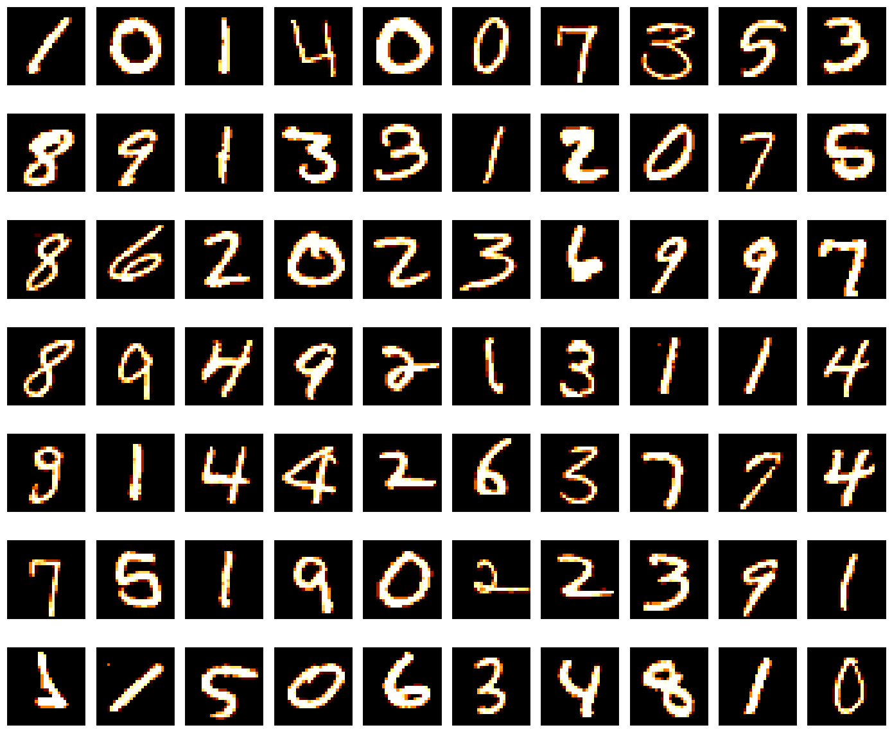
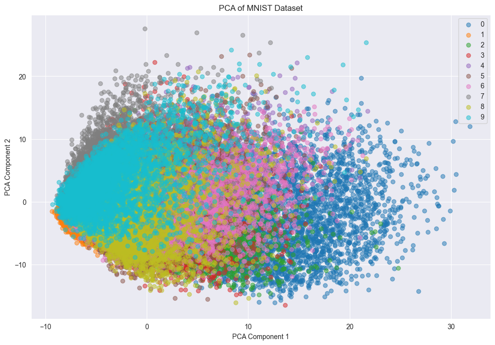
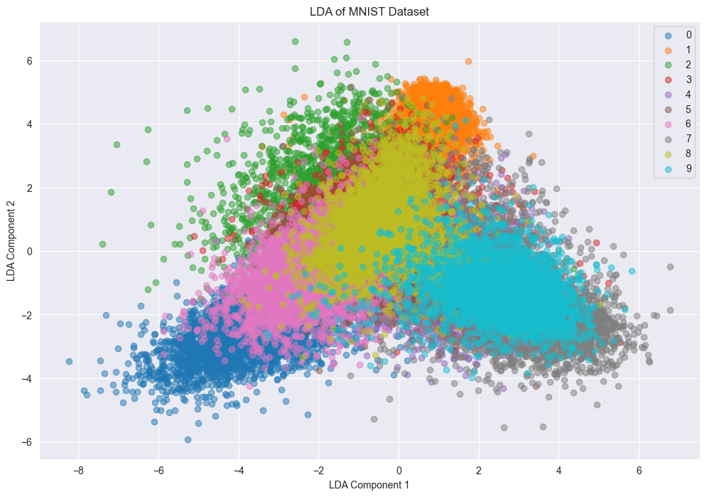
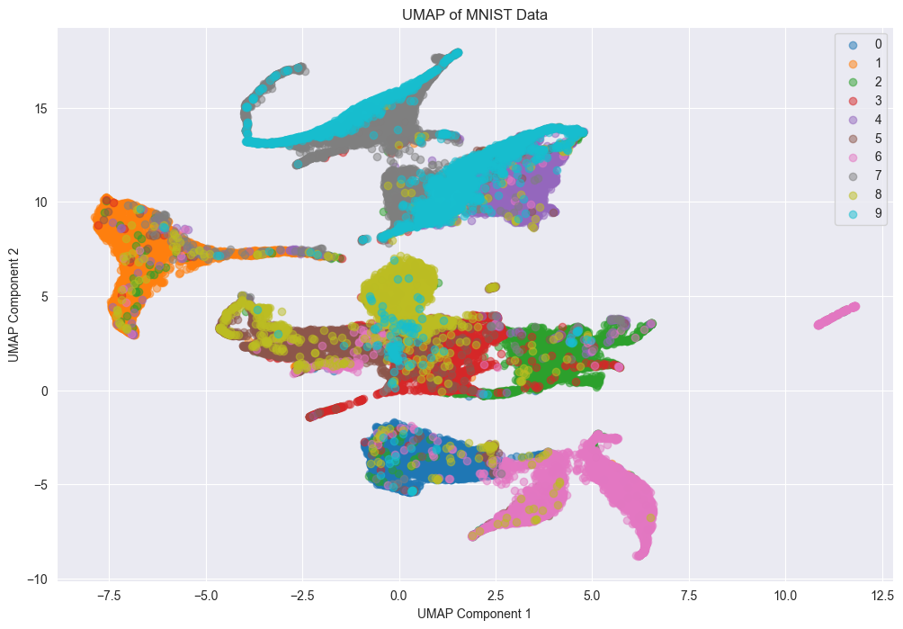
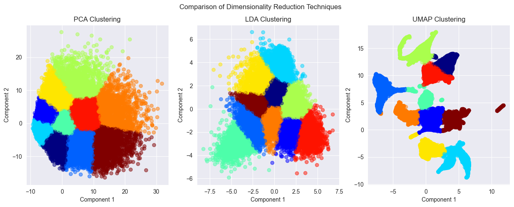

+++
title = "Dimensionality Reduction of the MNIST Dataset"
summary = "Exploring Principal Component Analysis (PCA), Linear Discriminant Analysis (LDA) and UMAP to perform dimensionality reduction on the MNIST dataset."
description = ""
featuredImage = ""
tags = ["Dimensionality Reduction", "MNIST", "PCA", "LDA", "UMAP"]
categories = ["AI"]
collections = [""]
weight = 8
draft = false
+++

Dimensionality Reduction is a powerful unsupervised machine learning technique that is widely used in data analytics and data science to help visualize data, select good features, and to train models efficiently. We use dimensionality reduction to take higher-dimensional data and represent it in a lower dimension. There are many dimensionality reduction algorithms to choose from and no single best algorithm for all cases. 

In this project, I explored three dimensionality reduction algorithms and different configurations for each algorithm.​​​​​​​


 View on Google Colab


## Load and Preprocess the Dataset

After loading the dataset, I noticed that there are 42,000 rows and 785 columns, among which 784 features were contributed by 28 x 28 pixels from each MNIST image and one label column. The label tells us the class (0 - 9) of each image. To compare the classification accuracy later, I only used the training dataset that has the label.

```py
# Load the dataset
df_train = pd.read_csv('digit-recognizer/train.csv')
df_test = pd.read_csv('digit-recognizer/test.csv')
print(df_train.shape)
```
```
(42000, 785)
```

First, I separated the features and the label, and applied the `StandardScaler` to standardize the features. 

```py
# Separate features and label from the training data
df_features = df_train.iloc[:, 1:785]
df_label = df_train.iloc[:, 0]

# Standardize the data
X = df_features.values
X_std = StandardScaler().fit_transform(X)
```

I also used `matplotlib` to display some of the numbers to get a better understanding of the data.

```py
# Display some of the numbers
plt.figure(figsize=(14,12))
for digit_num in range(0,70):
    plt.subplot(7,10,digit_num+1)
    grid_data = df_features.iloc[digit_num].values.reshape(28,28)  # reshape from 1d to 2d pixel array
    plt.imshow(grid_data, interpolation = "none", cmap = "afmhot")
    plt.xticks([])
    plt.yticks([])
plt.tight_layout()
```



## Dimensionality Reduction Techniques

The methods I chose were PCA, LDA and UMAP. After implementing each method, I used `matplotlib` to create a scatterplot to represent the first two components and color-coded labels.

### Principal Component Analysis (PCA)

PCA is an unsupervised, linear transformation algorithm that projects the original features onto a smaller set of features while retaining most of the information.

I chose this method because it can preserve the global structure, and it's very fast and memory-efficient. I implemented it using `sklearn.decomposition.PCA`.

```py
# Number of components
n_components = 2

# Perform PCA on the standardized data
pca = PCA(n_components=n_components)
X_pca = pca.fit_transform(X_std)

# Plot the PCA components
plt.figure(figsize=(12, 8))
for digit in np.unique(df_label):
    subset = X_pca[df_label == digit]
    plt.scatter(subset[:, 0], subset[:, 1], label=str(digit), alpha=0.5)
plt.title('PCA of MNIST Dataset')
plt.xlabel('PCA Component 1')
plt.ylabel('PCA Component 2')
plt.legend()
plt.show()
```


### Linear Discriminant Analysis (LDA)

LDA is also a linear transformation method like PCA, but the difference is that LDA is a supervised method that uses labels to maximize the separation between classes in a lower dimensional space. I implemented it using `sklearn.discriminant_analysis.LinearDiscriminantAnalysis`.

```py
# Perform LDA on the standardized data
lda = LDA(n_components=n_components)
X_lda = lda.fit_transform(X_std, df_label.values)

# Plot the LDA components
plt.figure(figsize=(12, 8))
for digit in np.unique(df_label):
    subset = X_lda[df_label == digit]
    plt.scatter(subset[:, 0], subset[:, 1], label=str(digit), alpha=0.5)
plt.title('LDA of MNIST Dataset')
plt.xlabel('LDA Component 1')
plt.ylabel('LDA Component 2')
plt.legend()
plt.show()
```



### Uniform Manifold Approximation and Projection (UMAP)

UMAP is a nonlinear, manifold-based method that seeks to preserve local data structure.​​​​​​​

```py
# Perform UMAP on the standardized data
umap_model = umap.UMAP(n_components=2, n_jobs=1, random_state=42)
X_umap = umap_model.fit_transform(X_std)

# Plot the UMAP components
plt.figure(figsize=(12, 8))
for digit in np.unique(df_label):
    subset = X_umap[df_label == digit]
    plt.scatter(subset[:, 0], subset[:, 1], label=str(digit), alpha=0.5)
plt.title("UMAP of MNIST Data")
plt.xlabel("UMAP Component 1")
plt.ylabel("UMAP Component 2")
plt.legend()
plt.show()
```


## Comparison and Evaluation

I used several metrics to evaluate these three methods, first I used **K-Means Clustering** on each reduced dataset to visualize the clusters of different digits and to evaluate their quality.

I used two numerical metrics to show how well each method performed:
- **Silhouette Score**: Measures how similar points are to their own cluster vs other clusters (higher is better).
- **Davies-Bouldin Score**: Measures the average similarity between clusters (lower is better).

To measure how well the reduced data preserves class information, I trained a **K-Nearest Neighbors (KNN)** classifier and tested it on each reduced dataset to give an accuracy score for each method.​​​​​​​

### K-Means clustering

```py
# Store all reduced datasets in a dictionary
methods = {
    'PCA': X_pca,
    'LDA': X_lda,
    'UMAP': X_umap
}

# Use KMeans to evaluate cluster separability
n_clusters = len(np.unique(df_label))

plt.figure(figsize=(15, 5))
for i, (method_name, data) in enumerate(methods.items(), 1):
    kmeans = KMeans(n_clusters=n_clusters, n_init=n_clusters, random_state=42)
    clusters = kmeans.fit_predict(data)
    plt.subplot(1, 3, i)
    plt.scatter(data[:, 0], data[:, 1], c=clusters, cmap='jet', alpha=0.5)
    plt.title(f'{method_name} Clustering')
    plt.xlabel('Component 1')
    plt.ylabel('Component 2')

plt.suptitle('Comparison of Dimensionality Reduction Techniques')
plt.show()
```



### Silhouette Score

Ranges from -1 to 1, a higher silhouette scores (close to 1) indicate better defined clusters. Negative scores indicate poor or incorrect clustering.

```py
# Silhouette Score for each method
scores = {}
for method, data in {'PCA': X_pca, 'LDA': X_lda, 'UMAP': X_umap}.items():
    score = silhouette_score(data, kmeans.labels_)
    scores[method] = round(score, 4)
print(f"Silhouette Score: \n {scores}")
```

```
Silhouette Score: 
 {'PCA': -0.081, 'LDA': 0.0545, 'UMAP': 0.5043}
```

The result shows that of the three methods, UMAP is the best at preserving the data's structure.
- PCA has low separability between clusters.
- LDA has a slight improvement over PCA.
- UMAP has the highest separability.

### Davies-Bouldin Score

```py
# Davies-Bouldin Score for each method
scores_db = {}
for method, data in {'PCA': X_pca, 'LDA': X_lda, 'UMAP': X_umap}.items():
    score_db = davies_bouldin_score(data, kmeans.labels_)
    scores_db[method] = round(score_db, 4)
print(f"Davies-Bouldin Score: \n {scores_db}")
```

```
Davies-Bouldin Score: 
 {'PCA': 5.7021, 'LDA': 3.7188, 'UMAP': 0.6824}
```

Lower values indicate better separation. The result shows that of the three methods, UMAP also has the best cluster separation.
- PCA has poor separation and compactness.
- LDA has a better separation than PCA.
- UMAP has the best separation and compactness.

### Comparing Classification Accuracy

Classification accuracy can show how well the reduced data preserves the original information. Higher accuracy indicates better preservation of class information in the reduced space.

```py
# Compare classification accuracy of each method
classification_accuracies = {}
for method, data in {'PCA': X_pca, 'LDA': X_lda, 'UMAP': X_umap}.items():
    X_train, X_test, y_train, y_test = train_test_split(data, df_label, test_size=0.2, random_state=42)
    knn = KNeighborsClassifier(n_neighbors=5)
    knn.fit(X_train, y_train)
    y_pred = knn.predict(X_test)
    accuracy = accuracy_score(y_test, y_pred)
    classification_accuracies[method] = round(accuracy, 4)
print(f"Classification Accuracy: \n {classification_accuracies}")
```

```
Classification Accuracy: 
 {'PCA': 0.3282, 'LDA': 0.5113, 'UMAP': 0.9106}
```

The high accuracy score of UMAP indicates that it has effectively preserved class separability, which aligns with its reputation for capturing complex structures in high-dimensional data.
- PCA has low class structure preservation.
- LDA has moderate class structure preservation.
- UMAP has excellent class structure preservation.

## Summary

For MNIST dimensionality reduction, UMAP significantly outperforms both PCA and LDA. As a non-linear, unsupervised method, it achieves a high silhouette score and the lowest Davies-Bouldin score. Classification accuracy also shows that UMAP preserves class information effectively.