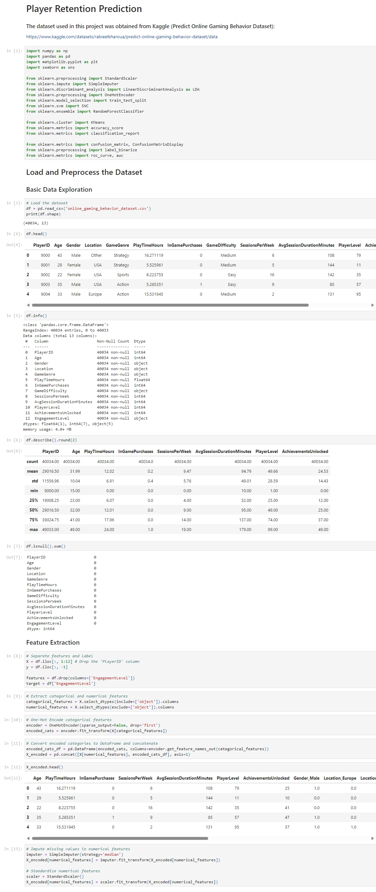
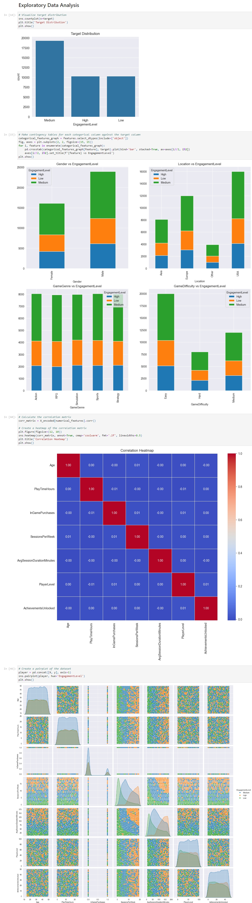
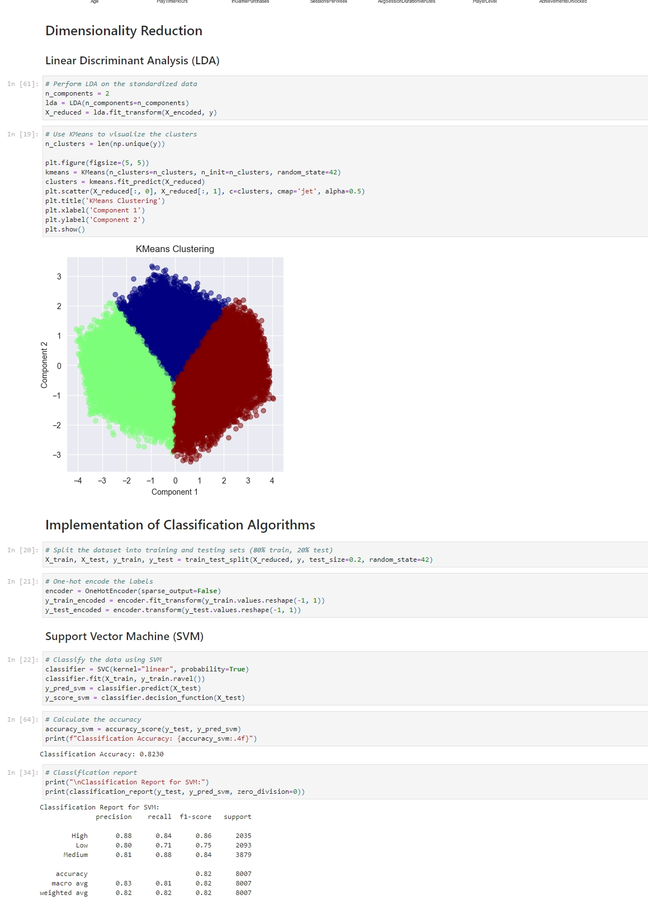
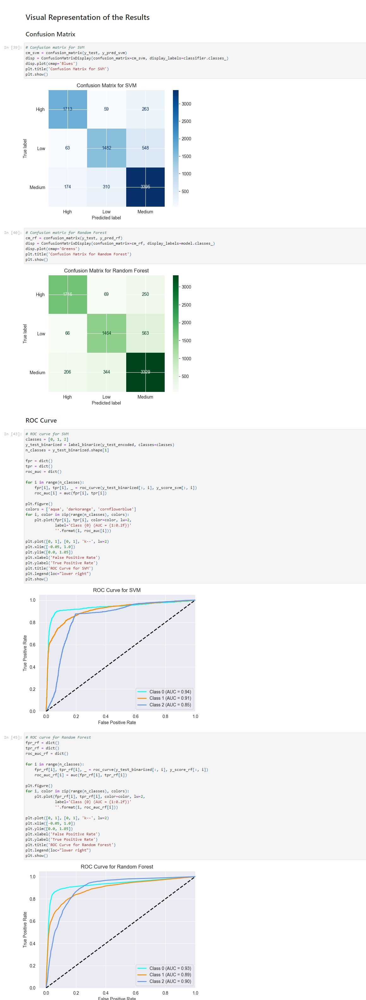

+++
title = "Player Retention Prediction"
summary = "Applying Random Forests and Support Vector Machines (SVM) for player retention prediction."
description = ""
featuredImage = ""
tags = ["SVM", "Random Forests"]
categories = ["AI"]
collections = [""]
draft = false
+++

## Abstract

The project intends to apply machine learning approaches to forecast player online gaming behavior, ascertain which aspects most importantly affect player retention, and find which classification method best fits in estimating engagement levels. Using a dataset comprising player demographics, in-game behavior measures, and engagement results, we will apply **Random Forests** and **Support Vector Machines (SVM)** to identify trends in the data and generate accurate projections for player retention.​​​​​​​


 View on Google Colab



 Read Full Report


