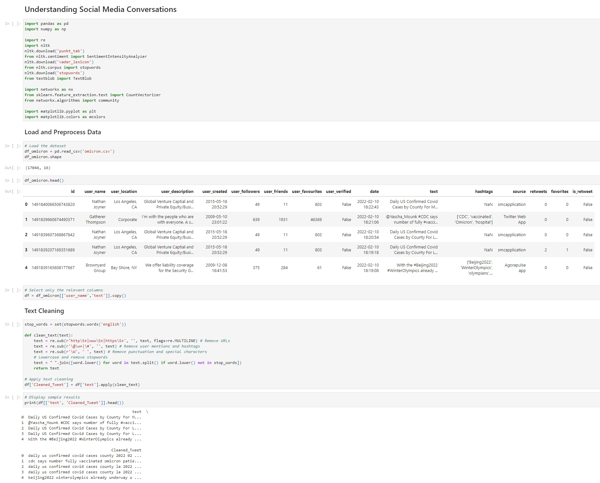
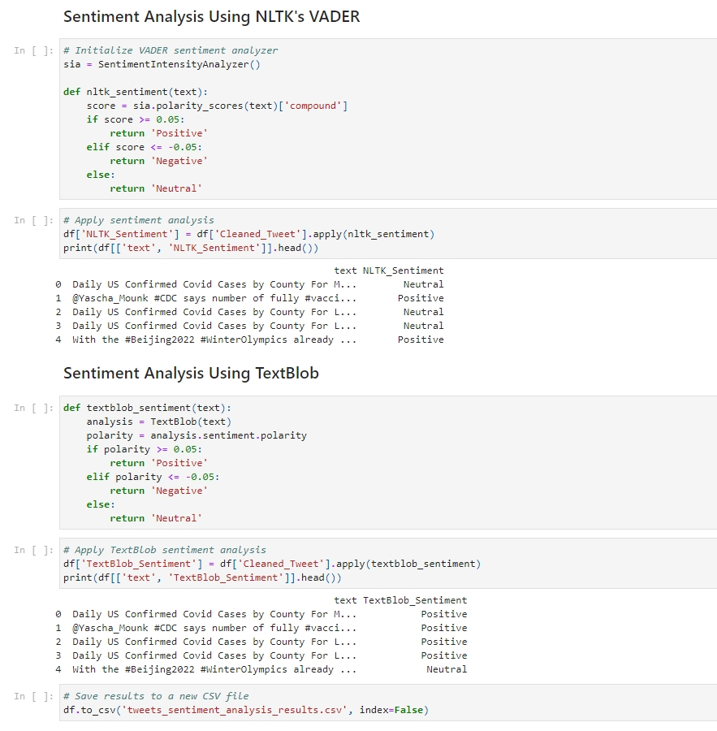
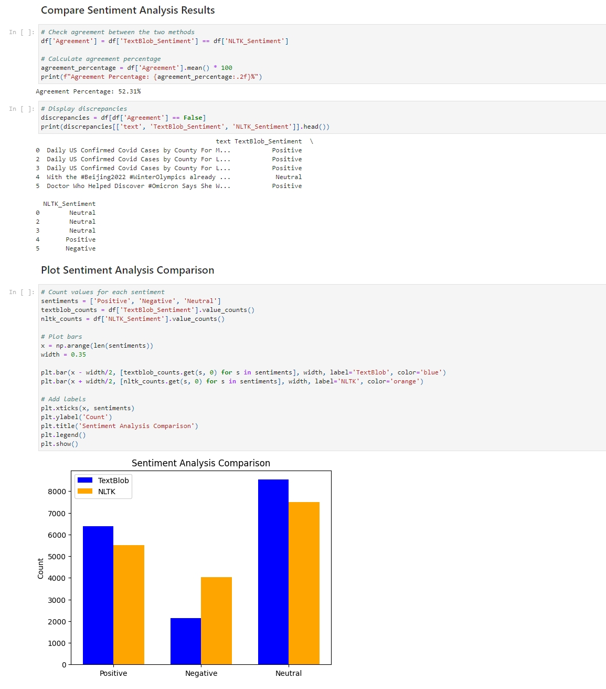
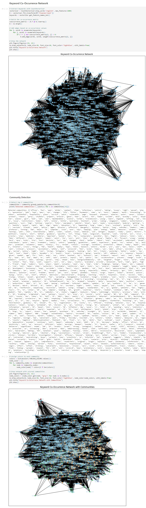
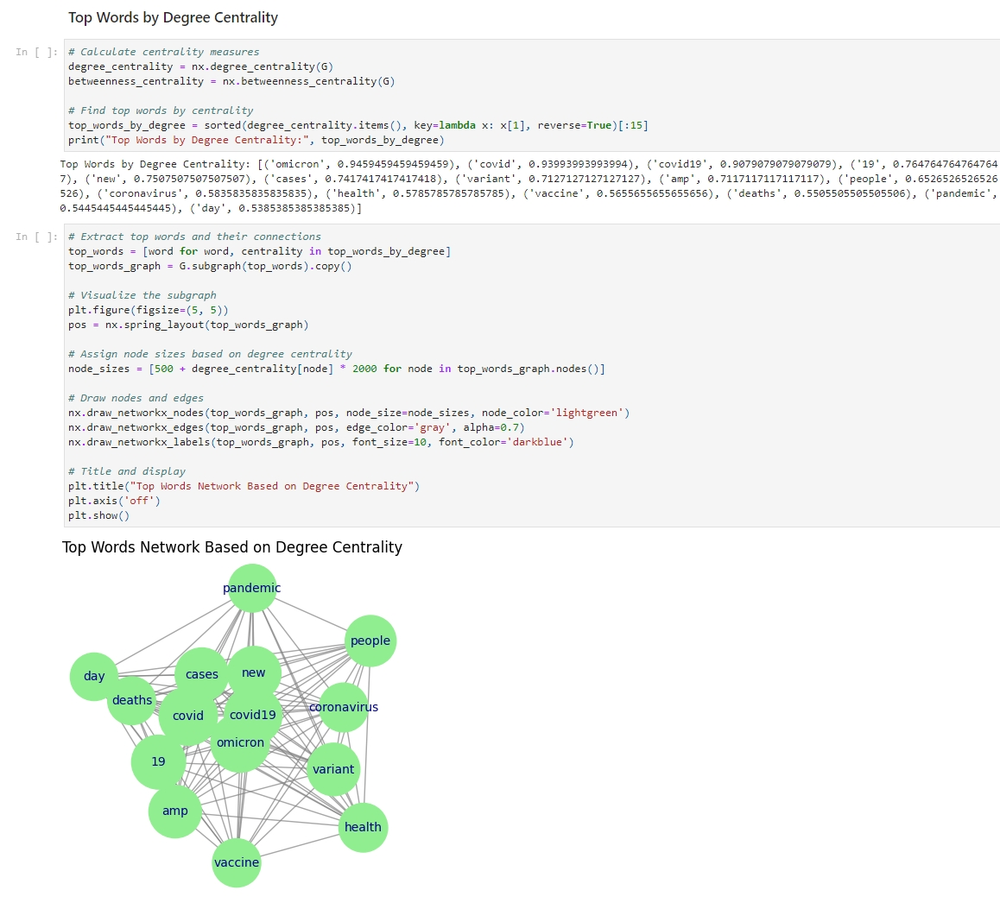

+++
title = "Sentiment Analysis of Social Media Conversations"
summary = "Using Sentiment Analysis to classify conversations on Twitter ABOUT THE COVID-19 OMICRON VARIANT and create graph-based network visualization."
description = ""
featuredImage = ""
tags = ["Sentiment Analysis", "NLTK", "TextBlob"]
categories = ["AI"]
collections = [""]
draft = false
+++

## Abstract

This project includes text cleaning and preprocessing, sentiment analysis using NLTK's VADER and TextBlob, comparison and visualization of the results of these two methods, and keyword-based network construction including community detection and highlighting important keywords.

I used Sentiment Analysis to classify conversations on **Twitter ABOUT THE COVID-19 OMICRON VARIANT** into Positive, Negative or Neutral and created graph-based network visualization and analytics.


 View on Google Colab


## Load and Preprocess Data

The first part is to import the necessary libraries, load and check the dataset using ***.shape*** and ***.head()***.

Then I selected only the user names and tweet text for analysis, and applied the text cleaning function to remove URLs, user mentions, hashtags, punctuation and convert text to lowercase, also removing common stopwords using the NLTK's predefined list.

## Sentiment Analysis

### NLTK's VADER

The first method I used is the ***SentimentIntensityAnalyzer*** from NLTK's VADER module and assigned a compound sentiment score to the text to classify the sentiments:
- Positive: Score ≥ 0.05
- Negative: Score ≤ -0.05
- Neutral: Otherwise

After applying the ***nltk_sentiment*** function, I added a ***NLTK_Sentiment*** column to the dataset.

### TextBlob

Another method I used is **TextBlob** to compute polarity values, and also use the same score to classify the text sentiment.
- Positive: Polarity ≥ 0.05
- Negative: Polarity ≤ -0.05
- Neutral: Otherwise

After applying the ***textblob_sentiment*** function, I added a ***TextBlob_Sentiment*** column to the dataset.​​​​​​​

## Compare Sentiment Analysis Results
- **Agreement Percentage**: I calculated the percentage of matching sentiments to evaluate consistency between the two methods.
- **Discrepancies**: Then I listed the tweets where the two methods gave different results.
- **Sentiment Distribution Visualization**: To get a clearer view of the comparison, I created a bar chart comparing the number of sentiment classes from both methods.

## Keyword Co-Occurrence Network

To visualize and analyze the network to understand topics and keywords, I used ***CountVectorizer*** to identify frequent words.

First, I extracted keywords from the cleaned text of each tweet, and then built a network by creating edges based on word co-occurrences. So if two words appear in the same tweet, an edge is added between them.

Then I applied a greedy modularity algorithm to detect communities within the network, they can represent specific subtopics.

For a clearer visualization, I updated the network by coloring the nodes based on their community. ​​​​​​​

Another graph I created is a subgraph of the top words. I used centrality metrics and extracted nodes with the highest centrality scores to find the most influential ones.

