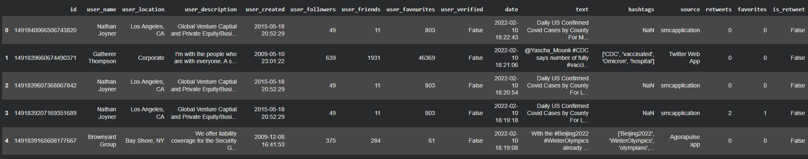
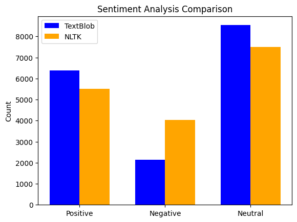
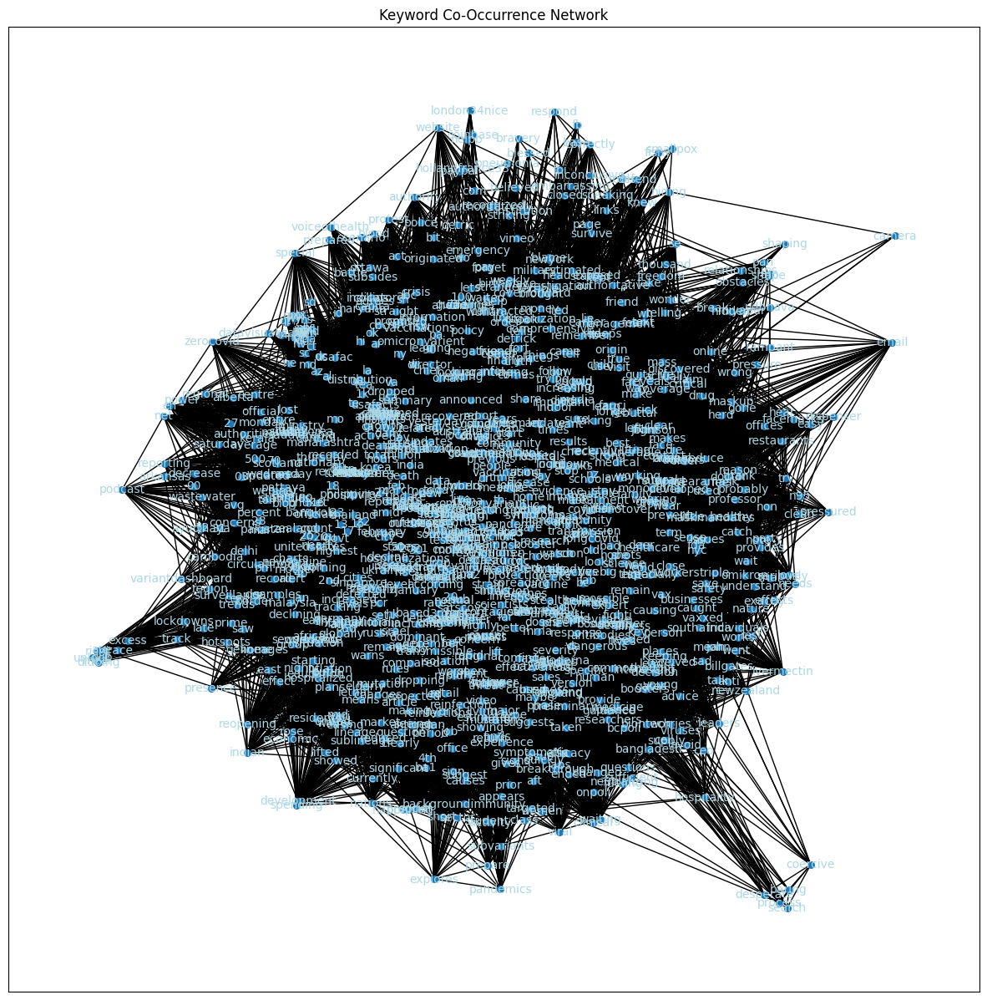
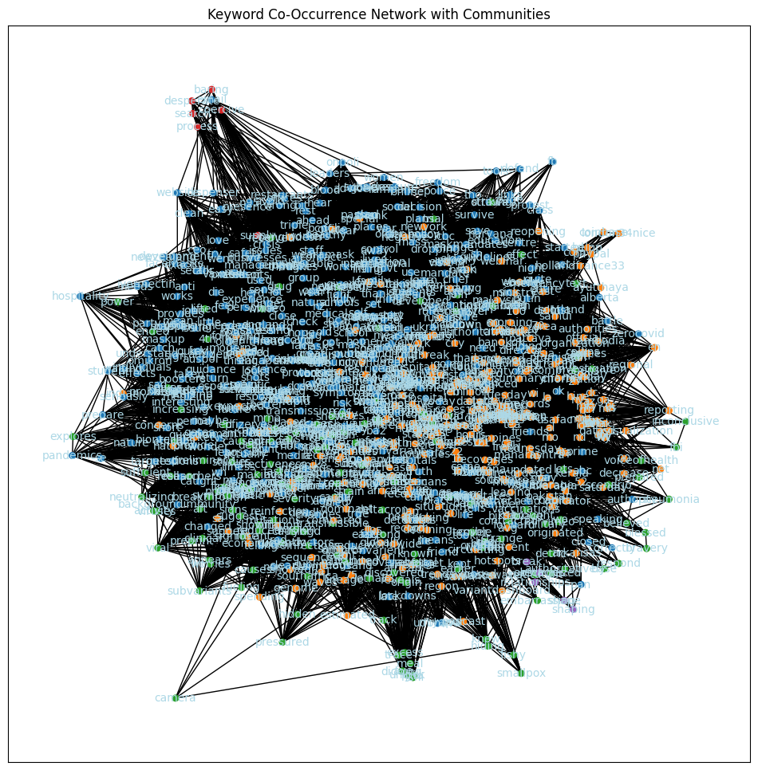
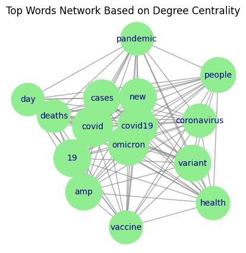

+++
title = "Sentiment Analysis of Social Media Conversations"
summary = "Using Sentiment Analysis to classify conversations on Twitter ABOUT THE COVID-19 OMICRON VARIANT and create graph-based network visualization."
description = ""
featuredImage = ""
tags = ["Sentiment Analysis", "NLTK", "TextBlob"]
categories = ["AI"]
collections = [""]
weight = 9
draft = false
+++

## Abstract

This project includes text cleaning and preprocessing, sentiment analysis using **NLTK's VADER** and **TextBlob**, comparison and visualization of the results of these two methods, and keyword-based network construction including community detection and highlighting important keywords.

I used Sentiment Analysis to classify conversations on [Twitter ABOUT THE COVID-19 OMICRON VARIANT](https://www.kaggle.com/datasets/gpreda/omicron-rising/data) into Positive, Negative or Neutral and created graph-based network visualization and analytics.


 View on Google Colab


## Load and Preprocess Data

The first part is to import the necessary libraries, load and check the dataset using `.shape` and `.head()`.

```py
# Load the dataset
df_omicron = pd.read_csv('omicron.csv')
df_omicron.shape
```
```
(17046, 16)
```

```py
df_omicron.head()
```


Then I selected only the user names and tweet text for analysis, and applied the text cleaning function to remove URLs, user mentions, hashtags, punctuation and convert text to lowercase, also removing common stopwords using the NLTK's predefined list.

```py
# Select only the relevant columns
df = df_omicron[['user_name','text']].copy()
```
```py
stop_words = set(stopwords.words('english'))

def clean_text(text):
    text = re.sub(r'http\S+|www\S+|https\S+', '', text, flags=re.MULTILINE) # Remove URLs
    text = re.sub(r'\@\w+|\#', '', text) # Remove user mentions and hashtags
    text = re.sub(r'\W', ' ', text) # Remove punctuation and special characters
    # Lowercase and remove stopwords
    text = " ".join([word.lower() for word in text.split() if word.lower() not in stop_words])
    return text

# Apply text cleaning
df['Cleaned_Tweet'] = df['text'].apply(clean_text)
```

## Sentiment Analysis

### NLTK's VADER

The first method I used is the `SentimentIntensityAnalyzer` from **NLTK's VADER** module and assigned a compound sentiment score to the text to classify the sentiments:
- Positive: Score ≥ 0.05
- Negative: Score ≤ -0.05
- Neutral: Otherwise

```py
# Initialize VADER sentiment analyzer
sia = SentimentIntensityAnalyzer()

def nltk_sentiment(text):
    score = sia.polarity_scores(text)['compound']
    if score >= 0.05:
        return 'Positive'
    elif score <= -0.05:
        return 'Negative'
    else:
        return 'Neutral'
```
After applying the `nltk_sentiment` function, I added a `NLTK_Sentiment` column to the dataset.

```py
# Apply sentiment analysis
df['NLTK_Sentiment'] = df['Cleaned_Tweet'].apply(nltk_sentiment)
```

### TextBlob

Another method I used is **TextBlob** to compute polarity values, and also use the same score to classify the text sentiment.
- Positive: Polarity ≥ 0.05
- Negative: Polarity ≤ -0.05
- Neutral: Otherwise

```py
def textblob_sentiment(text):
    analysis = TextBlob(text)
    polarity = analysis.sentiment.polarity
    if polarity >= 0.05:
        return 'Positive'
    elif polarity <= -0.05:
        return 'Negative'
    else:
        return 'Neutral'
```

After applying the `textblob_sentiment` function, I added a `TextBlob_Sentiment` column to the dataset.​​​​​​​

```py
# Apply TextBlob sentiment analysis
df['TextBlob_Sentiment'] = df['Cleaned_Tweet'].apply(textblob_sentiment)
```

## Compare Sentiment Analysis Results
- **Agreement Percentage**: I calculated the percentage of matching sentiments to evaluate consistency between the two methods.
    ```py
    # Check agreement between the two methods
    df['Agreement'] = df['TextBlob_Sentiment'] == df['NLTK_Sentiment']

    # Calculate agreement percentage
    agreement_percentage = df['Agreement'].mean() * 100
    print(f"Agreement Percentage: {agreement_percentage:.2f}%")
    ```
    ```
    Agreement Percentage: 52.31%
    ```
- **Discrepancies**: Then I listed the tweets where the two methods gave different results.
    ```py
    # Display discrepancies
    discrepancies = df[df['Agreement'] == False]
    print(discrepancies[['text', 'TextBlob_Sentiment', 'NLTK_Sentiment']].head())
    ```
    ```
                                                    text TextBlob_Sentiment  \
    0  Daily US Confirmed Covid Cases by County For M...           Positive   
    2  Daily US Confirmed Covid Cases by County For L...           Positive   
    3  Daily US Confirmed Covid Cases by County For L...           Positive   
    4  With the #Beijing2022 #WinterOlympics already ...            Neutral   
    5  Doctor Who Helped Discover #Omicron Says She W...           Positive   

    NLTK_Sentiment  
    0        Neutral  
    2        Neutral  
    3        Neutral  
    4       Positive  
    5       Negative  
    ```
- **Sentiment Distribution Visualization**: To get a clearer view of the comparison, I created a bar chart comparing the number of sentiment classes from both methods.
    ```py
    # Count values for each sentiment
    sentiments = ['Positive', 'Negative', 'Neutral']
    textblob_counts = df['TextBlob_Sentiment'].value_counts()
    nltk_counts = df['NLTK_Sentiment'].value_counts()

    # Plot bars
    x = np.arange(len(sentiments))
    width = 0.35

    plt.bar(x - width/2, [textblob_counts.get(s, 0) for s in sentiments], width, label='TextBlob', color='blue')
    plt.bar(x + width/2, [nltk_counts.get(s, 0) for s in sentiments], width, label='NLTK', color='orange')

    # Add labels
    plt.xticks(x, sentiments)
    plt.ylabel('Count')
    plt.title('Sentiment Analysis Comparison')
    plt.legend()
    plt.show()
    ```
    

## Keyword Co-Occurrence Network

To visualize and analyze the network to understand topics and keywords, I used `CountVectorizer` to identify frequent words.

First, I extracted keywords from the cleaned text of each tweet, and then built a network by creating edges based on word co-occurrences. So if two words appear in the same tweet, an edge is added between them.

```py
# Extract keywords with CountVectorizer
vectorizer = CountVectorizer(stop_words='english', max_features=1000)
X = vectorizer.fit_transform(df['Cleaned_Tweet'])
keywords = vectorizer.get_feature_names_out()

# Build the co-occurrence matrix
cooccurrence_matrix = (X.T @ X).toarray()
G = nx.Graph()

# Add edges based on co-occurrence values
for i, word1 in enumerate(keywords):
    for j, word2 in enumerate(keywords):
        if i != j and cooccurrence_matrix[i, j] > 0:
            G.add_edge(word1, word2, weight=cooccurrence_matrix[i, j])

# Draw the network
plt.figure(figsize=(15, 15))
nx.draw_networkx(G, node_size=30, font_size=10, font_color='lightblue', with_labels=True)
plt.title("Keyword Co-Occurrence Network")
plt.show()
```



Then I applied a greedy modularity algorithm to detect communities within the network, they can represent specific subtopics.

```py
# Detect top 5 communities
communities = community.greedy_modularity_communities(G)
```

For a clearer visualization, I updated the network by coloring the nodes based on their community. ​​​​​​​

```py
# Assign colors to each community
colors = list(mcolors.TABLEAU_COLORS.values())
node_color = {}
for i, community_nodes in enumerate(communities):
    for node in community_nodes:
        node_color[node] = colors[i % len(colors)]

# Draw network with colored communities
plt.figure(figsize=(12, 12))
node_colors = [node_color.get(node, "gray") for node in G.nodes()]
nx.draw_networkx(G, node_size=30, font_size=10, font_color='lightblue', node_color=node_colors, with_labels=True)
plt.title("Keyword Co-Occurrence Network with Communities")
plt.show()
```




Another graph I created is a subgraph of the top words. I used centrality metrics and extracted nodes with the highest centrality scores to find the most influential ones.

```py
# Calculate centrality measures
degree_centrality = nx.degree_centrality(G)
betweenness_centrality = nx.betweenness_centrality(G)

# Find top words by centrality
top_words_by_degree = sorted(degree_centrality.items(), key=lambda x: x[1], reverse=True)[:15]

# Extract top words and their connections
top_words = [word for word, centrality in top_words_by_degree]
top_words_graph = G.subgraph(top_words).copy()

# Visualize the subgraph
plt.figure(figsize=(5, 5))
pos = nx.spring_layout(top_words_graph)

# Assign node sizes based on degree centrality
node_sizes = [500 + degree_centrality[node] * 2000 for node in top_words_graph.nodes()]

# Draw nodes and edges
nx.draw_networkx_nodes(top_words_graph, pos, node_size=node_sizes, node_color='lightgreen')
nx.draw_networkx_edges(top_words_graph, pos, edge_color='gray', alpha=0.7)
nx.draw_networkx_labels(top_words_graph, pos, font_size=10, font_color='darkblue')

# Title and display
plt.title("Top Words Network Based on Degree Centrality")
plt.axis('off')
plt.show()
```


