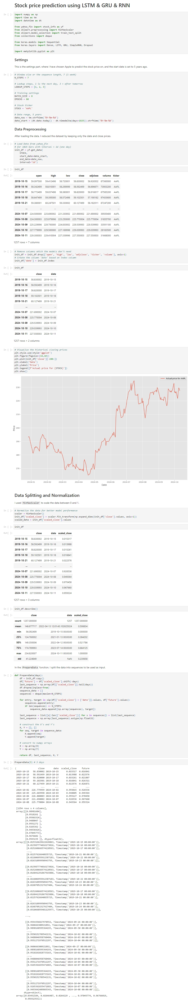
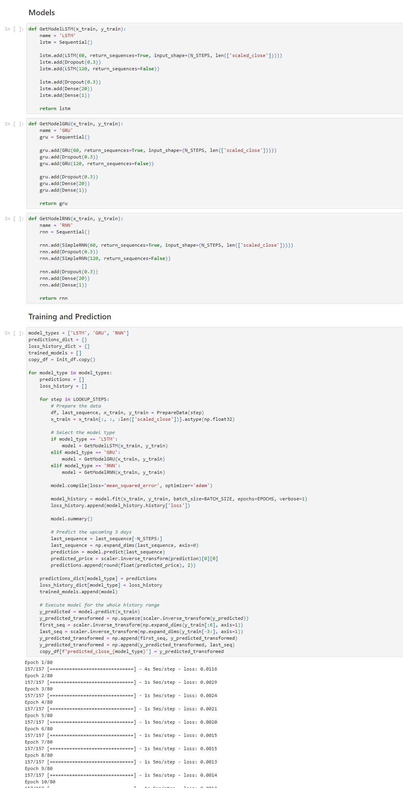
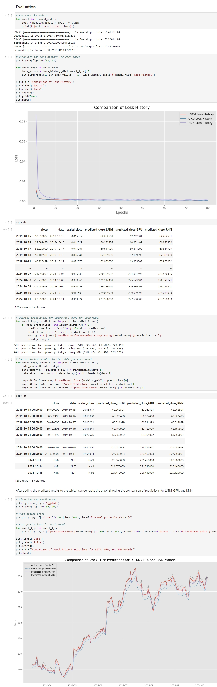
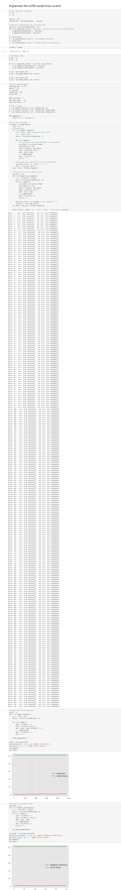

+++
title = "Stock Prices Prediction"
summary = "Using Long Short-Term Memory Network (LSTM), Gated Recurrent Units (GRU) and Recurrent Neural Network (RNN) to predict the stock prices. "
description = ""
featuredImage = ""
tags = ["LSTM", "GRU", "RNN"]
categories = ["AI"]
collections = [""]
weight = 6
draft = false
+++

In this project, I decided to use Long Short-Term Memory Network (LSTM), Gated Recurrent Units (GRU) and Recurrent Neural Network (RNN) to predict the stock prices. 

First, I defined functions to build these models. Then, I iterated each model to train, validate, and evaluate it. Finally, I used the trained models to predict future stock prices and visualize the predictions.

Additionally, I experimented building the outperforming model from scratch.


 View on Google Colab


Based on the predictions and evaluations, we can see that the LSTM has a low loss history, and it also predicted the price closer to the actual historical closing prices. In conclusion, the LSTM model outperformed the other models, so I tried to implement the LSTM model from scratch next.

First I tried to keep a set of validation data, then make predictions on both the training and validation data to evaluate the model's performance.

However, the loss in the output doesn't change, something is wrong with the learning process, and since the model is not well trained, the visualization result of the predictions is not correct either. But I think the learning purpose of this project has already been served, so I'll leave it at that.