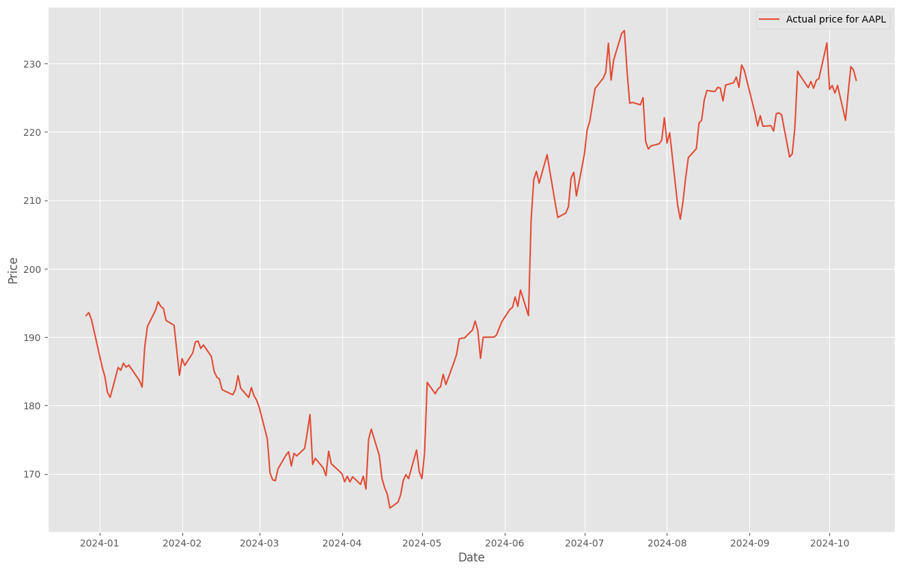
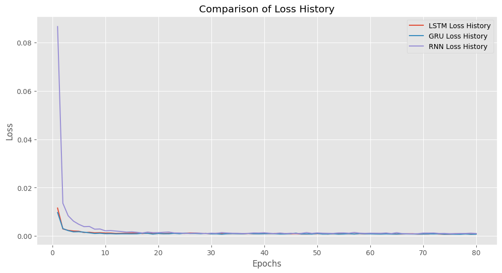
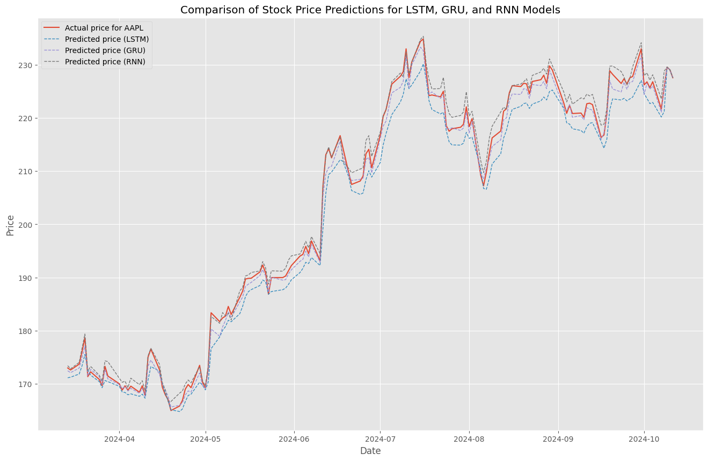

+++
title = "Neural Networks for Stock Prices Prediction"
summary = "Using Long Short-Term Memory Network (LSTM), Gated Recurrent Units (GRU) and Recurrent Neural Network (RNN) to predict the stock prices. "
description = ""
featuredImage = ""
tags = ["LSTM", "GRU", "RNN"]
categories = ["AI"]
collections = [""]
weight = 6
draft = false
+++

## Introduction

There are two ways to create a neural network:
- **From Scratch** – this can be a good learning exercise, as we can learn how neural networks work from the ground up
- **Using a Neural Network Library** – packages like Keras, PyTouch and TensorFlow simplify the
building of neural networks by abstracting away the low-level code.

In this project, I decided to use Long Short-Term Memory Network (LSTM), Gated Recurrent Units (GRU) and Recurrent Neural Network (RNN) to predict the stock prices. 

 I let the training and prediction functions to iterate each model for training, validation, and evaluation, sharing the same parameters for better evaluation. Then, I used the trained models to predict future stock prices and visualize the results. Additionally, I experimented building the outperforming model from scratch.


 View on Google Colab


## Settings
This is the settings part, where I have chosen Apple to predict the stock price on, and the start date is set to 5 years ago.

```py
# Window size or the sequence length, 7 (1 week)
N_STEPS = 7

# Lookup steps, 1 is the next day, 3 = after tomorrow
LOOKUP_STEPS = [1, 2, 3]

# Training settings
BATCH_SIZE = 8
EPOCHS = 80

# Stock ticker
STOCK = 'AAPL'

# Date range, 5 years
date_now = tm.strftime('%Y-%m-%d')
date_start = (dt.date.today() - dt.timedelta(days=1825)).strftime('%Y-%m-%d')
```

## Data Preprocessing

First, I need to prepare the dataset for training and testing, I loaded the data using `yahoo_fin`. After loading the data, I reduced the dataset by keeping only the date and close prices.

```py
# Load Data from yahoo_fin
# for 1825 bars with interval = 1d (one day)
init_df = yf.get_data(
    STOCK,
    start_date=date_start,
    end_date=date_now,
    interval='1d')

# Remove columns which the models don't need
init_df = init_df.drop(['open', 'high', 'low', 'adjclose', 'ticker', 'volume'], axis=1)
# Create the column 'date' based on index column
init_df['date'] = init_df.index
```

Then I created a graph to visualize the historical closing prices of this stock:

```py
# Visualize the data
plt.style.use(style='ggplot')
plt.figure(figsize=(16,10))
plt.plot(init_df['close'][-200:])
plt.xlabel('Date')
plt.ylabel('Price')
plt.legend([f'Actual price for {STOCK}'])
plt.show()
```



## Data Splitting and Normalization

I used `MinMaxScaler`  to scale the data between 0 and 1.

```py
# Normalize the data for better model performance
scaler = MinMaxScaler()
init_df['scaled_close'] = scaler.fit_transform(np.expand_dims(init_df['close'].values, axis=1))
scaled_data = init_df['scaled_close'].values
```

In the `PrepareData` function, I split the data into sequences to be used as input.

```py
def PrepareData(days):
    df = init_df.copy()
    df['future'] = df['scaled_close'].shift(-days)
    last_sequence = np.array(df[['scaled_close']].tail(days))
    df.dropna(inplace=True)
    sequence_data = []
    sequences = deque(maxlen=N_STEPS)

    for entry, target in zip(df[['scaled_close'] + ['date']].values, df['future'].values):
        sequences.append(entry)
        if len(sequences) == N_STEPS:
            sequence_data.append([np.array(sequences), target])

    last_sequence = list([s[:len(['scaled_close'])] for s in sequences]) + list(last_sequence)
    last_sequence = np.array(last_sequence).astype(np.float32)

    # construct the X's and Y's
    X, Y = [], []
    for seq, target in sequence_data:
        X.append(seq)
        Y.append(target)

    # convert to numpy arrays
    X = np.array(X)
    Y = np.array(Y)

    return df, last_sequence, X, Y
```

## Models

### Recurrent Neural Networks (RNNs)

RNNs are designed to handle sequential data by maintaining a hidden state that captures information from previous time steps.
- **Advantages:** They are suitable for short-term dependencies in the data.
- **Limitations:** RNNs struggle with long-term dependencies due to the vanishing gradient problem.

```py
def GetModelRNN(x_train, y_train):
    name = 'RNN'
    rnn = Sequential()

    rnn.add(SimpleRNN(60, return_sequences=True, input_shape=(N_STEPS, len(['scaled_close']))))
    rnn.add(Dropout(0.3))
    rnn.add(SimpleRNN(120, return_sequences=False))
        
    rnn.add(Dropout(0.3))
    rnn.add(Dense(20))
    rnn.add(Dense(1))

    return rnn
```

### Long Short-Term Memory (LSTM) Networks

LSTMs are a special type of RNN designed to overcome the limitations of traditional RNNs. They use gates to control the flow of information, making them effective at capturing long-term dependencies.
- **Advantages:** LSTMs are widely used in financial predictions because they can handle long sequences of data and remember important trends over time.
- **Applications:** They are commonly used for predicting stock prices, currency exchange rates, and other time series data.

```py
def GetModelLSTM(x_train, y_train):
    name = 'LSTM'
    lstm = Sequential()
    
    lstm.add(LSTM(60, return_sequences=True, input_shape=(N_STEPS, len(['scaled_close']))))
    lstm.add(Dropout(0.3))
    lstm.add(LSTM(120, return_sequences=False))
        
    lstm.add(Dropout(0.3))
    lstm.add(Dense(20))
    lstm.add(Dense(1))

    return lstm
```

### Gated Recurrent Units (GRUs)

GRUs are similar to LSTMs but have a simpler architecture with fewer gates. This makes them computationally efficient while still handling long-term dependencies well.
- **Advantages:** GRUs often perform as well as LSTMs in practice but with a reduced computational cost.
- **Applications:** Like LSTMs, they are used for time series forecasting, including stock price prediction.

```py
def GetModelGRU(x_train, y_train):
    name = 'GRU'
    gru = Sequential()
    
    gru.add(GRU(60, return_sequences=True, input_shape=(N_STEPS, len(['scaled_close']))))
    gru.add(Dropout(0.3))
    gru.add(GRU(120, return_sequences=False))
     
    gru.add(Dropout(0.3))
    gru.add(Dense(20))
    gru.add(Dense(1))

    return gru
```

## Training and Prediction

```py
model_types = ['LSTM', 'GRU', 'RNN']
predictions_dict = {}
loss_history_dict = {}
trained_models = []
copy_df = init_df.copy()

for model_type in model_types:
    predictions = []
    loss_history = []
    
    for step in LOOKUP_STEPS:
        # Prepare the data
        df, last_sequence, x_train, y_train = PrepareData(step)
        x_train = x_train[:, :, :len(['scaled_close'])].astype(np.float32) 
        
        # Select the model type
        if model_type == 'LSTM':
            model = GetModelLSTM(x_train, y_train)
        elif model_type == 'GRU':
            model = GetModelGRU(x_train, y_train)
        elif model_type == 'RNN':
            model = GetModelRNN(x_train, y_train)
        
        model.compile(loss='mean_squared_error', optimizer='adam')
        
        model_history = model.fit(x_train, y_train, batch_size=BATCH_SIZE, epochs=EPOCHS, verbose=1)
        loss_history.append(model_history.history['loss'])
        
        model.summary()

        # Predict the upcoming 3 days
        last_sequence = last_sequence[-N_STEPS:]
        last_sequence = np.expand_dims(last_sequence, axis=0)
        prediction = model.predict(last_sequence)
        predicted_price = scaler.inverse_transform(prediction)[0][0]
        predictions.append(round(float(predicted_price), 2))
        
    predictions_dict[model_type] = predictions
    loss_history_dict[model_type] = loss_history
    trained_models.append(model)

    # Execute model for the whole history range
    y_predicted = model.predict(x_train)
    y_predicted_transformed = np.squeeze(scaler.inverse_transform(y_predicted))
    first_seq = scaler.inverse_transform(np.expand_dims(y_train[:6], axis=1))
    last_seq = scaler.inverse_transform(np.expand_dims(y_train[-3:], axis=1))
    y_predicted_transformed = np.append(first_seq, y_predicted_transformed)
    y_predicted_transformed = np.append(y_predicted_transformed, last_seq)
    copy_df[f'predicted_close_{model_type}'] = y_predicted_transformed
```

## Evaluation

```py
# Evaluate the models 
for model in trained_models:
    loss = model.evaluate(x_train, y_train)
    print(f'{model.name} Loss: {loss}')
```

I plotted the loss history to compare the training performance of the three models:

```py
# Visualize the model loss for each model
plt.figure(figsize=(12, 6))

for model_type in model_types:
    loss_values = loss_history_dict[model_type][0]  
    plt.plot(range(1, len(loss_values) + 1), loss_values, label=f'{model_type} Loss History')

plt.title('Comparison of Loss History')
plt.xlabel('Epochs')
plt.ylabel('Loss')
plt.legend()
plt.grid(True)
plt.show()
```



These are the predictions for the next 3 days from each model:

```py
# Display predictions for upcoming 3 days for each model
for model_type, predictions in predictions_dict.items():
    if bool(predictions) and len(predictions) > 0:
        predictions_list = [str(d)+'$' for d in predictions]
        predictions_str = ', '.join(predictions_list)
        message = f'{STOCK} prediction for upcoming 3 days using {model_type} ({predictions_str})'
        print(message)
```
```
AAPL prediction for upcoming 3 days using LSTM (229.66$, 234.07$, 224.41$)
AAPL prediction for upcoming 3 days using GRU (225.46$, 231.51$, 226.44$)
AAPL prediction for upcoming 3 days using RNN (228.38$, 226.46$, 229.12$)
```

After adding the predicted results to the table, I can generate this graph showing the comparison of predictions for LSTM, GRU, and RNN:

```py
# Add predicted results to the table for each model
for model_type, predictions in predictions_dict.items():
    date_now = dt.date.today()
    date_tomorrow = dt.date.today() + dt.timedelta(days=1)
    date_after_tomorrow = dt.date.today() + dt.timedelta(days=2)

    copy_df.loc[date_now, f'predicted_close_{model_type}'] = predictions[0]
    copy_df.loc[date_tomorrow, f'predicted_close_{model_type}'] = predictions[1]
    copy_df.loc[date_after_tomorrow, f'predicted_close_{model_type}'] = predictions[2]

# Visualize the predictions
plt.style.use(style='ggplot')
plt.figure(figsize=(16, 10))

# Plot actual price
plt.plot(copy_df['close'][-150:].head(147), label=f'Actual price for {STOCK}')

# Plot predictions for each model
for model_type in model_types:
    plt.plot(copy_df[f'predicted_close_{model_type}'][-150:].head(147), linewidth=1, linestyle='dashed', label=f'Predicted price ({model_type})')

plt.xlabel('Date')
plt.ylabel('Price')
plt.legend()
plt.title('Comparison of Stock Price Predictions for LSTM, GRU, and RNN Models')
plt.show()
```




Based on the predictions and evaluations, we can see that the LSTM has a low loss history, and it also predicted the price closer to the actual historical closing prices. In conclusion, the LSTM model outperformed the other models, so I tried to implement the LSTM model from scratch next.

## Implement the LSTM Model from Scratch

First I tried to keep a set of validation data, then make predictions on both the training and validation data to evaluate the model's performance.

```py
# Split data into sequences
X = []
Y = []

seq_len = 50
num_records = len(scaled_data) - seq_len

# Separate training data and validation data
val_size = int(len(scaled_data) * 0.2)
for i in range(num_records - val_size):  # Reserve records for validation data
    X.append(scaled_data[i:i + seq_len])
    Y.append(scaled_data[i + seq_len])

X = np.array(X)
X = np.expand_dims(X, axis=2)  # Add feature dimension
Y = np.array(Y)
Y = np.expand_dims(Y, axis=1)  # Make target array compatible
```

```py
# Validation data
X_val = []
Y_val = []

for i in range(num_records - val_size, num_records):
    X_val.append(scaled_data[i:i + seq_len])
    Y_val.append(scaled_data[i + seq_len])

X_val = np.array(X_val)
X_val = np.expand_dims(X_val, axis=2)

Y_val = np.array(Y_val)
Y_val = np.expand_dims(Y_val, axis=1)
```

```py
# Define hyperparameters
learning_rate = 0.001
nepoch = 250
T = seq_len
hidden_dim = 100
output_dim = 1

bptt_truncate = 5
min_clip_value = -10
max_clip_value = 10

# Define weights
U = np.random.uniform(0, 0.01, (hidden_dim, T))
W = np.random.uniform(0, 0.01, (hidden_dim, hidden_dim))
V = np.random.uniform(0, 0.01, (output_dim, hidden_dim))

def sigmoid(x):
    return 1 / (1 + np.exp(-x))
```

### Training

```py
# Train the LSTM model
for epoch in range(nepoch):
    loss = 0.0
    # Forward pass
    for i in range(Y.shape[0]):
        # Get input, output values of each record
        x, y = X[i], Y[i]
        prev_s = np.zeros((hidden_dim, 1))

        for t in range(T):
            # Forward pass for every timestep in the sequence
            new_input = np.zeros(x.shape)
            new_input[t] = x[t]
            mulu = np.dot(U, new_input)
            mulw = np.dot(W, prev_s)
            add = mulw + mulu
            s = sigmoid(add)
            mulv = np.dot(V, s)
            prev_s = s
        
        # Calculate the squared error for the predictions
        loss_per_record = (y - mulv) ** 2 / 2
        loss += loss_per_record
    loss = loss / float(y.shape[0])

    # Check the loss on validation data
    val_loss = 0.0
    for i in range(Y_val.shape[0]):
        x, y = X_val[i], Y_val[i]
        prev_s = np.zeros((hidden_dim, 1))
        for t in range(T):
            new_input = np.zeros(x.shape)
            new_input[t] = x[t]
            mulu = np.dot(U, new_input)
            mulw = np.dot(W, prev_s)
            add = mulw + mulu
            s = sigmoid(add)
            mulv = np.dot(V, s)
            prev_s = s

        loss_per_record = (y.reshape(-1, 1) - mulv)**2 / 2
        val_loss += loss_per_record
    val_loss = val_loss / float(y.shape[0])

    print('Epoch:', epoch + 1, ', Loss:', loss, ', Val Loss:', val_loss)
```

### Prediction

```py
# Predict on the training data
preds = []
for i in range(Y.shape[0]):
    x, y = X[i], Y[i]
    prev_s = np.zeros((hidden_dim, 1))
    
    for t in range(T):
        mulu = np.dot(U, x)
        mulw = np.dot(W, prev_s)
        add = mulw + mulu.reshape(-1, 1)
        s = sigmoid(add)
        mulv = np.dot(V, s)
        prev_s = s

    preds.append(mulv)

preds = np.array(preds)
plt.plot(preds[:, 0, 0], 'g', label='Predictions')
plt.plot(Y[:, 0], 'r', label='Actual Values')
plt.legend()
plt.show()
```

```py
# Predict on validation data
val_preds = []
for i in range(Y_val.shape[0]):
    x, y = X_val[i], Y_val[i]
    prev_s = np.zeros((hidden_dim, 1))
    for t in range(T):
        mulu = np.dot(U, x)
        mulw = np.dot(W, prev_s)
        add = mulw + mulu
        s = sigmoid(add)
        mulv = np.dot(V, s)
        prev_s = s

    val_preds.append(mulv)

val_preds = np.array(val_preds)
plt.plot(val_preds[:, 0, 0], 'g', label='Validation Predictions')
plt.plot(Y_val[:, 0], 'r', label='Actual Values')
plt.legend()
plt.show()
```

However, the loss in the output doesn't change, something is wrong with the learning process, and since the model is not well trained, the visualization result of the predictions is not correct either. But I think the learning purpose of this project has already been served, so I'll leave it at that.