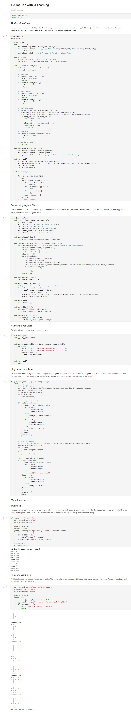

+++
title = "Tic-Tac-Toe with Q-Learning"
summary = ""
description = ""
featuredImage = ""
tags = ["Q-Learning Agent"]
categories = ["AI"]
collections = [""]
weight = 4
draft = false
+++

This program implements the Tic-Tac-Toe game using a customized object-oriented approach. After trying out the OpenAI Gym TicTacToe, the TTT class example and the following method, I decided to refactor the code from the tutorial to make it more object-oriented and more efficient.

[Reinforcement Learning - Implement TicTacToe | Towards Data Science](https://towardsdatascience.com/reinforcement-learning-implement-tictactoe-189582bea542/)

In this implementation, I transformed the ***State*** class into a ***TicTacToe*** class, which is only responsible for managing the game logic, such as the board states, winning conditions, available positions, etc. The ***QLearningAgent*** class focuses on the Q-learning agentʼs responsibilities, including training, selecting actions based on Q-values, and learning by updating policies based on rewards from the game result. Additionally, the ***HumanPlayer*** class allows a human player to input moves.


 View on Google Colab


### Other Improvements:

1. Available Positions: In the example, the program checked the entire board for available moves each time. I improved this by keeping a list of available positions that gets updated after a move, that is removing the recent position from the available positions when a move is made.

2. Winner Checking: Instead of checking all rows, columns, and diagonals after each move, I improved the program to only checks the relevant row, column, and diagonal where the last move occurred.

In the main function, I first set up two AI agents to play against each other for training. After the training phase, change one player to a human player, allowing the human player to interact with the trained agent.

### Training Process

The agent is trained by using two Q-learning agents, one for each player. The agents play against each other for a specified number of rounds. After each round, both agents update their Q-values based on the outcome:
- **Win**: The agent that wins receives a reward of 1.
- **Tie**: Both agents receive a reward of 0.5.
- **Loss**: The losing agent receives a reward of 0.

These rewards drive the learning process, the agent will adjust its Q-values to maximize the expected future reward over time.

Rewards are propagated backward through the agent’s state history.

During the training, the agents occasionally make random moves to explore new strategies, the exploration is encouraged through the exploration rate. As training progresses, agents start to exploit their learned Q-values more frequently, tending to take actions that historically led to better results.

Once training is complete, the agent’s policy is saved to a file.

### Human vs. Agent

A Q-learning agent is loaded with the saved policy. The human player can play against the agent by taking turns on the board. The game continues until the human player decides to stop.

