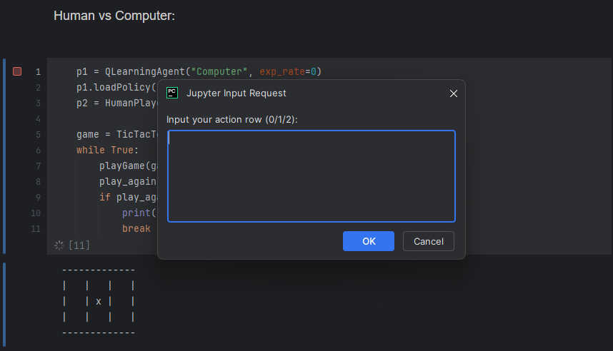

+++
title = "Tic-Tac-Toe with Q-Learning"
summary = "Implementing the Tic-Tac-Toe game using reinforcement learning."
description = ""
featuredImage = ""
tags = ["Q-Learning Agent"]
categories = ["AI"]
collections = [""]
weight = 4
draft = false
+++

## Introduction

This program implements the Tic-Tac-Toe game using a customized object-oriented approach. After experimenting the OpenAI Gym TicTacToe, the TTT class example and the following method, I decided to refactor the code from this tutorial to make it more object-oriented and more efficient.

[Reinforcement Learning - Implement TicTacToe | Towards Data Science](https://towardsdatascience.com/reinforcement-learning-implement-tictactoe-189582bea542/)

In this implementation, I transformed the `State` class into a `TicTacToe` class, which is only responsible for managing the game logic, such as the board states, winning conditions, available positions, etc. The `QLearningAgent` class focuses on the Q-learning agent’s responsibilities, including training, selecting actions based on Q-values, and learning by updating policies based on rewards from the game result. Additionally, the `HumanPlayer` class allows a human player to input moves. 

### Other Improvements:

1. Available Positions: In the example, the program checked the entire board for available moves each time. I improved this by keeping a list of available positions that gets updated after a move, that is removing the recent position from the available positions when a move is made.

2. Winner Checking: Instead of checking all rows, columns, and diagonals after each move, I improved the program to only checks the relevant row, column, and diagonal where the last move occurred.

In the main function, I first set up two AI agents to play against each other for training. After the training phase, change one player to a human player, allowing the human player to interact with the trained agent.


 View on Google Colab


## Tic-Tac-Toe Class

The game board is represented by a 3x3 NumPy array, where each element can be `0` (empty), `1` (Player 1), or `-1` (Player 2). This class handles board updates, checking for a winner, determining available moves, and resetting the game. 

```py
BOARD_ROWS = 3
BOARD_COLS = 3

class TicTacToe:
    def __init__(self):
        self.board = np.zeros((BOARD_ROWS, BOARD_COLS))
        self.availablePositions = [(i, j) for i in range(BOARD_ROWS) for j in range(BOARD_COLS)]
        self.isEnd = False
        self.playerSymbol = 1  # 1 for p1, -1 for p2, p1 plays first
```

### Functions

- `getHash()`: Returns a unique hash for the current board state for the agent to use.
    ```py
    def getHash(self):
        # A unique hash for the current board state
        return str(self.board.reshape(BOARD_COLS * BOARD_ROWS))
    ```
- `winner()`: Checks if there is a winner or if the game has ended in a tie.
    ```py
    def winner(self, last_move):
        # Use the last move to determine if there is a winner
        row, col = last_move

        # Check Row:
        if sum(self.board[row, :]) == 3:
            self.isEnd = True
            return 1
        if sum(self.board[row, :]) == -3:
            self.isEnd = True
            return -1

        # Check Column:
        if sum(self.board[:, col]) == 3:
            self.isEnd = True
            return 1
        if sum(self.board[:, col]) == -3:
            self.isEnd = True
            return -1

        # Check Diagonal:
        if row == col or row + col == BOARD_COLS - 1:
            diag_sum1 = sum([self.board[i, i] for i in range(BOARD_COLS)])
            diag_sum2 = sum([self.board[i, BOARD_COLS - i - 1] for i in range(BOARD_COLS)])
            if diag_sum1 == 3 or diag_sum2 == 3:
                self.isEnd = True
                return 1
            if diag_sum1 == -3 or diag_sum2 == -3:
                self.isEnd = True
                return -1

        # Check Tie:
        if len(self.availablePositions) == 0:
            self.isEnd = True
            return 0

        # Game is not over:
        return None
    ```
- `updateState()`: Updates the board with the current player's move.
    ```py
    def updateState(self, position):
        self.board[position] = self.playerSymbol
        self.availablePositions.remove(position)
        self.playerSymbol = -1 if self.playerSymbol == 1 else 1 # Switch player
    ```
- `reset()`: Resets the board and game state for a new round.
    ```py
    def reset(self):
        self.board = np.zeros((BOARD_ROWS, BOARD_COLS))
        self.availablePositions = [(i, j) for i in range(BOARD_ROWS) for j in range(BOARD_COLS)]
        self.isEnd = False
        self.playerSymbol = 1
    ```
- `showBoard()`: Display the current board state.
    ```py
    def showBoard(self): 
        print('-------------')
        for i in range(0, BOARD_ROWS):
            out = '| '
            for j in range(0, BOARD_COLS):
                if self.board[i, j] == 1:
                    token = 'x'
                if self.board[i, j] == -1:
                    token = 'o'
                if self.board[i, j] == 0:
                    token = ' '
                out += token + ' | '
            print(out)
        print('-------------')
    ```

## Q-Learning Agent Class

This class focuses on the Q-learning agent’s responsibilities, including training, selecting actions based on Q-values, and learning by updating policies based on rewards from the game result.

### Attributes

```py
def __init__(self, name, exp_rate=0.3):
    self.name = name
    self.states = []  # record all positions taken
    self.lr = 0.2  # learning rate
    self.exp_rate = exp_rate  # exploration rate
    self.decay_gamma = 0.9  # discount factor
    self.states_value = {}  # state -> value
```

- `lr`: Learning rate, controls how much new information overwrites old information.
- `exp_rate`: Exploration rate, determines the probability of the agent taking a random action instead of exploiting learned values.
- `decay_gamma`: Discount factor, determines how much future rewards affect current decisions.
- `states_value`: A dictionary mapping board states to their expected value (Q-values).

### Functions
- `getHash()`: Returns a unique hash for the current board state for the agent to use.
    ```py
    def getHash(self, board):
        return str(board.reshape(BOARD_COLS * BOARD_ROWS))
    ```
- `chooseAction()`: Chooses the next move, either by exploring (random action) or exploiting (choosing the action with the highest Q-value).
    ```py
    def chooseAction(self, positions, current_board, symbol):
        if np.random.uniform(0, 1) <= self.exp_rate: # Random action (exploration)
            idx = np.random.choice(len(positions))
            return positions[idx]
        else: # Action based on Q-value (exploitation)
            value_max = -999
            for p in positions:
                next_board = current_board.copy()
                next_board[p] = symbol
                next_boardHash = self.getHash(next_board)
                value = 0 if self.states_value.get(next_boardHash) is None else self.states_value.get(next_boardHash)
                if value >= value_max:
                    value_max = value
                    action = p
            return action
    ```
- `addState()`: Records the state after each action.
    ```py
    def addState(self, state):
        self.states.append(state)
    ```
- `feedReward()`: Propagates the reward back through the state history after the game ends.
    ```py
    def feedReward(self, reward):
        # Propagates the reward back through the state history
        for st in reversed(self.states):
            if self.states_value.get(st) is None:
                self.states_value[st] = 0
            self.states_value[st] += self.lr * (self.decay_gamma * reward - self.states_value[st])
            reward = self.states_value[st]
    ```
- `reset()`: Resets the board and game state for a new round.
    ```py
    def reset(self):
        self.states = []
    ```
- `savePolicy()`: Saves the learned state values (policy) to a file.
    ```py
    def savePolicy(self):
        with open(f'policy', 'wb') as fw:
            pickle.dump(self.states_value, fw)
    ```
- `loadPolicy()`: Loads a pre-trained policy from a file.
    ```py
    def loadPolicy(self, file):
        with open(file, 'rb') as fr:
            self.states_value = pickle.load(fr)
    ```

## Human Player Class

This class allows a human player to input moves.

```py
class HumanPlayer:
    def __init__(self, name):
        self.name = name

    def chooseAction(self, positions, current_board, symbol):
        while True:
            row = int(input("Input your action row (0/1/2): "))
            col = int(input("Input your action col (0/1/2): "))
            action = (row, col)
            if action in positions:
                return action

    def reset(self):
        pass
```

## Play Game Function

This function simulates a game between two players. The game continues until a player wins or the game ends in a tie. The function updates the game state, displays the board, rewards the players based on the game result, and resets the game for the next round.

```py
def playGame(game, p1, p2, training=False):
    while not game.isEnd:
        # Player 1's turn:
        p1_action = p1.chooseAction(game.availablePositions, game.board, game.playerSymbol)
        game.updateState(p1_action)
        p1.addState(game.getHash())
        if not training:
            game.showBoard()

        result = game.winner(p1_action)
        if result is not None:
            if result == 1:  # Player 1 wins
                if training:
                    p1.feedReward(1)
                    p2.feedReward(0)
                else:
                    print(f"{p1.name} wins!")
            else:  # Tie
                if training:
                    p1.feedReward(0.5)
                    p2.feedReward(0.5)
                else:
                    print("It's a tie!")
            p1.reset()
            p2.reset()
            game.reset()
            break

        # Player 2's move:
        p2_action = p2.chooseAction(game.availablePositions, game.board, game.playerSymbol)
        game.updateState(p2_action)
        if training:
            p2.addState(game.getHash())
        else:
            game.showBoard()

        result = game.winner(p2_action)
        if result is not None:
            if result == -1:  # Player 2 wins
                if training:
                    p1.feedReward(0)
                    p2.feedReward(1)
                else:
                    print(f"{p2.name} wins!")
            else:  # Tie
                if training:
                    p1.feedReward(0.5)
                    p2.feedReward(0.5)
                else:
                    print("It's a tie!")
            p1.reset()
            p2.reset()
            game.reset()
            break
```

## Training Process

```py
if __name__ == "__main__":
    p1 = QLearningAgent("p1")
    p2 = QLearningAgent("p2")

    game = TicTacToe()
    rounds = 10000
    print("Training the agent for {} rounds...".format(rounds))
    for i in range(rounds):
        if i % 1000 == 0:
            print("Rounds {}".format(i))
        playGame(game, p1, p2, training=True)
    
    # Save the policy:
    p1.savePolicy()
```

The agent is trained by using two Q-learning agents, one for each player. The agents play against each other for a specified number of rounds. After each round, both agents update their Q-values based on the outcome:
- **Win**: The agent that wins receives a reward of 1.
- **Tie**: Both agents receive a reward of 0.5.
- **Loss**: The losing agent receives a reward of 0.

These rewards drive the learning process, the agent will adjust its Q-values to maximize the expected future reward over time.

Rewards are propagated backward through the agent’s state history using the formula: 
 
$$
Q(s)=Q(s) + \alpha [r + \gamma \max(Q(s')) - Q(s)]
$$

Where:
-  \(Q(s)\) is the current state's value.
-  \(α\) is the learning rate.
-  \(r\) is the immediate reward.
-  \(γ\) is the discount factor.
-  \(Q(s′)\) is the maximum future reward from the next state.

During the training, the agents occasionally make random moves to explore new strategies, the exploration is encouraged through the exploration rate. As training progresses, agents start to exploit their learned Q-values more frequently, tending to take actions that historically led to better results.

Once training is complete, the agent’s policy is saved to a file.

## Human vs. Agent

A Q-learning agent is loaded with the saved policy. The human player can play against the agent by taking turns on the board. The game continues until the human player decides to stop.

```py
    p1 = QLearningAgent("Computer", exp_rate=0)
    p1.loadPolicy("policy")
    p2 = HumanPlayer("Human")

    game = TicTacToe()
    while True:
        playGame(game, p1, p2, training=False)
        play_again = input("Do you want to play again? (1/0): ")
        if play_again != '1':
            print("Game End. Thanks for playing!")
            break
```

 

```
-------------
|   |   |   | 
|   | x |   | 
|   |   |   | 
-------------
-------------
| o |   |   | 
|   | x |   | 
|   |   |   | 
-------------
-------------
| o |   |   | 
|   | x | x | 
|   |   |   | 
-------------
-------------
| o |   |   | 
| o | x | x | 
|   |   |   | 
-------------
-------------
| o |   |   | 
| o | x | x | 
|   |   | x | 
-------------
-------------
| o |   | o | 
| o | x | x | 
|   |   | x | 
-------------
-------------
| o |   | o | 
| o | x | x | 
| x |   | x | 
-------------
-------------
| o |   | o | 
| o | x | x | 
| x | o | x | 
-------------
-------------
| o | x | o | 
| o | x | x | 
| x | o | x | 
-------------
It's a tie!
Game End. Thanks for playing!
```
