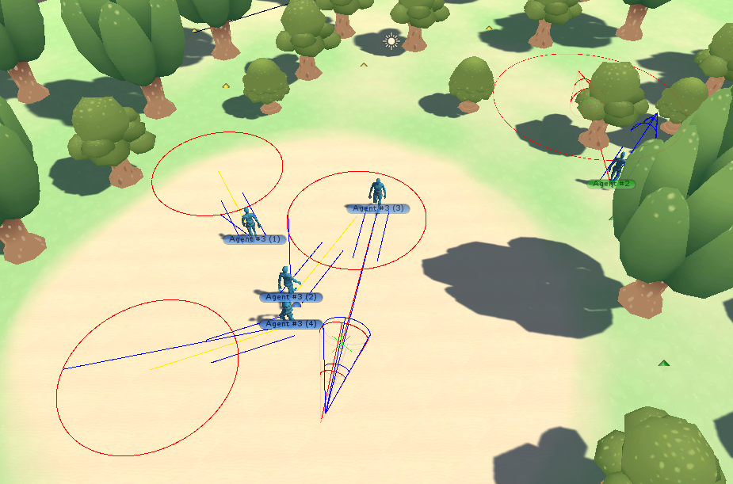
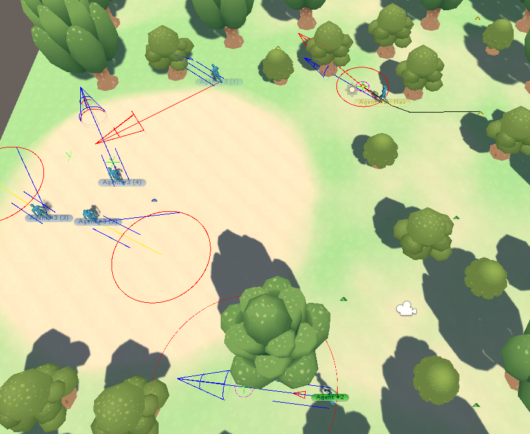
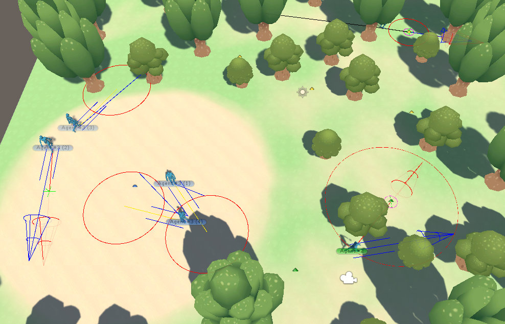
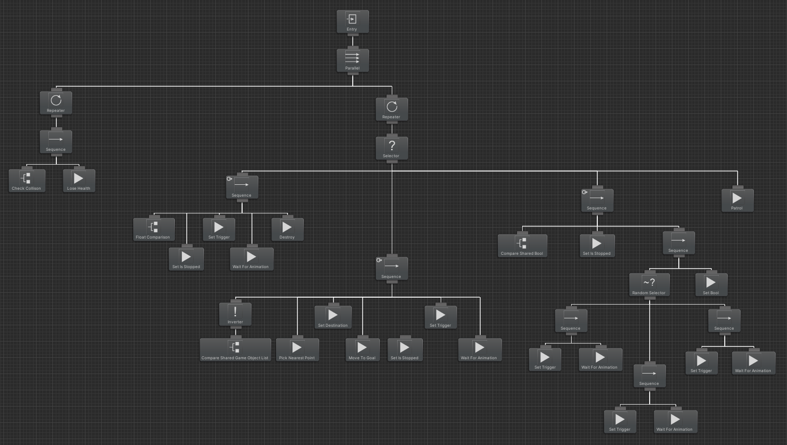

+++
title = "Game AI"
summary = "FSM, Steering Behavior, Behavior Tree"
description = ""
featuredImage = "SteeringBehaviour_01.png"
tags = ["FSM", "Steering Behavior", "Behavior Tree"]
categories = ["exercises"]
collections = ["Unity Prototype"]
draft = false
+++

## FSM - Hide and Seek


 View on Github




## Steering Behaviour


  
  
  


## Behavior Tree
